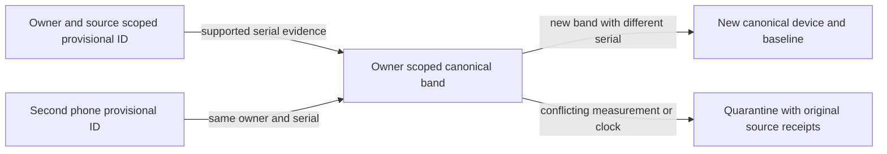

# Multi-user and fleet handoff

Branch: `feat/multiuser-scale`. Base: user-approved local server pipeline
`cfb94434b1b4ed4dba587e5c4e7af405e782e560`. Worktree:
`/Volumes/Untitled/WHOOP NARA-multiuser-scale`.

Application revision: `d10bf4321c5cc28072fe78da8f7d2fe7328297d6`. Additional restored-database
authorization proof: `2f7ea775f40c5ea43e9df53c69c7b141de54be7e` (test changes only).
The final handoff/evidence commit changes no application inputs. Measurements below were
collected on September 21, 2026, Pacific time. Local implementation and bounded verification
are complete; broader release is **NOT_READY** until the named physical/provider/VPS gates pass.

This extends the existing owner/source/device model. The original 117 migrations,
per-device baselines, object tenancy, source-bound credentials, input snapshots, leases,
immutable results and revision fences are preserved. No production access, deployment
or algorithm promotion occurred. The original dirty checkout is unchanged.

Inputs: `01_DEEP_AUDIT.md`, `02_PRODUCTION_BUILD_SPEC.md`,
`07_CODEX_ISSUE_MULTIUSER_SCALE.md` and `evidence/multiuser.md`, all under `MD FILES/` in the
original checkout. Their hashes and exact paths are in
[verification.json](evidence/multiuser/verification.json).

## Lifecycle

| Scenario | Implemented behavior | Baseline rule |
| --- | --- | --- |
| Different users, different phones | Each installation source has one immutable owner. The same external serial maps to distinct owner-scoped server device IDs. Reads and object completion derive ownership from credentials. | Isolated owner/device baselines. |
| One user, two phones, one band | Distinct phone sources resolve a supported serial to one canonical device under that owner. Equal measurements are projected once; both receptions and original object keys retain their source attribution. | Continue the same canonical device baseline. |
| Replacement wearable | Add a new device/pairing before connecting it. A different serial creates a different canonical device. Reusing a provisional pairing for another serial pauses upload and requires review/retirement. | Start a new baseline; do not copy old-band observations or personalized state. |
| Phone A reassigned to B | Retire A's installation, validate its server receipt, rotate to a fresh source, close/reopen the app, then enroll B. Open writers never change owner. | Fresh owner/source store and B-owned device baseline. |
| Replacement phone, same user | Enroll a fresh source with a new code for the same account. Retire the previous phone when available. | Confirming the same band continues its canonical baseline. |

```mermaid
stateDiagram-v2
    [*] --> FreshSource
    FreshSource --> ActiveOwnerA: enroll and bind first owner
    ActiveOwnerA --> RetirementPending: persist journal and fence runtime
    RetirementPending --> RetirementPending: offline or interrupted; retry
    RetirementPending --> RetiredSourceA: server receipt validated
    RetiredSourceA --> FreshSource: rotate source and restart
    FreshSource --> ActiveOwnerB: enroll B in a new epoch
```



The retired source row remains terminal and A-owned; the diagram's transition to a fresh
source creates a different row. Wearable identity proceeds independently:



Retirement is distinct from sign-out and account deletion. Native account controls use the
existing screens and destructive confirmation. A durable secure-storage journal fences
collection, credentials and account presentation before awaiting the network. Lost responses
or process interruption leave a resumable operation. Server retirement revokes every token
for that source; A2 remains operational when A1 retires. Neither the old source's owner nor
its retired state can be rewritten to make another enrollment succeed.

Both runtimes require restart because database/file handles are process-pinned. Old rows,
outbox debt and caches remain in their original namespace. Fresh epochs do not copy legacy
pairing metadata. Generation checks reject late enrollment responses. Delayed old-source
uploads cannot complete into B. Secure-storage failures keep collection blocked.

Old local records are retained, not relabeled or automatically uploaded after retirement.
Retire while the old enrollment is available. After ordinary sign-out, re-enroll the
original owner to retire; administrative revocation cannot migrate retained phone data.
Final device handover still needs its verified local-spool erasure procedure and, if the
wearable changes owner, its separately verified flash reset. No hardware erase is claimed.

### Identity confirmation and deduplication

Bluetooth addresses, CoreBluetooth UUIDs and legacy names are installation-scoped provisional
identities. Supported device-information serials use `whoop-<SERIAL>` under the owner.
Native association journals bind owner/source/provisional ID/serial, survive local serial
adoption and synchronize before upload. Serial callbacks must belong to the connected
peripheral; a changed selection cannot reattribute a delayed callback.

`POST /push/wearables/confirm` accepts `provisionalExternalDeviceId` and
`evidence: { method: "device_information_serial_v1", serial, receiptSha256 }`.
The Edge handler supplies owner/source from the credential. This witness records native
acquisition; the hash is not independent cryptographic hardware attestation.

Confirmation acquires both device input gates in stable UUID order, merges attributable
scalar projections, transfers quarantine markers and dirties affected results. It preserves
original receipts, raw manifests, observations and object keys. Raw discovery follows only
the immutable alias for the same owner/source; byte verification still checks the original
object's tenant/device key. Corrections or deletion invalidate the canonical dependency.
Provisional results are not copied into canonical baselines.

Natural measurement keys deduplicate scalar copies. RR packet identity uses sensor second
and record index; equal RR values at different sequence positions remain distinct beats.
Validated copies with different transport headers/CRC compare their sensor payload; both
original raw packets remain in source observations and only one sensor packet feeds physiology.
Physiology or clock disagreement quarantines canonical measurements, and retries cannot
resurrect them. Source receptions remain available for review. Unsupported timing is not
promoted into physiological continuity.

Reviewed model adapter `verified-npb1-extraction-2` deduplicates identical physical records
across raw objects and rejects contradictory bytes/mappings. Original object attestations,
timing/units review, activation hashes and revision scope remain mandatory. Adapter version 1
retains its prior replay rejection. Contracts and algorithm approvals are not auto-upgraded.

### Collection handoff

`POST /push/wearables/handoff` takes `externalDeviceId` and optional
`expectedGeneration`. It returns owner/source/device, generation and expiry. The online
lease lasts 120 seconds; renew or transfer with the last generation, or take over after
expiry. Stale generations return 409. Retired installations cannot acquire a lease.

This is an online coordination contract, not a remote disconnect for offline BLE centrals.
Stop/disconnect the previous phone, transfer the generation (or wait for expiry), then
connect the next phone. Delayed uploads retain their source and are deduplicated. Automatic
cross-phone BLE handoff and physical acquisition continuity remain unmeasured.

## Fleet policy

- Physiology: four global reservations, two per user, two per device, one per owner/device/day.
  The daemon also skips another active day of a busy device. Live work (current/previous
  local day and future dependency invalidations) gets three dispatch opportunities per one
  backfill opportunity. Within each class, the least recently served owner goes first.
- Reservations survive revision replacement until the attempt settles or its lease expires.
  Input churn cannot discard a live reservation to evade the compute limit.
- The short scheduler mutex is not held during computation. Input-gate acquisition precedes
  claim; release follows the consistent snapshot. Publication still checks revision,
  lease token and run ID. Busy-device skipping and cursor ordering remain intact.
- Model/history lanes default to one slot each and prefer the least recently served owner.
  History permits one claim per owner. Activation, output validation, predecessor and
  checkpoint rules remain authoritative.
- Successful queues drain without an eight-second sleep after every eight jobs. Idle/error
  cycles retain the configured interval. `auto` worker IDs are unique per process while
  the packaged source revision remains mandatory.
- Atomic intake limits default to 200 requests/source/minute and 600 requests/user/minute.
  Existing body-size, object-size and decompression bounds remain in force.

Policy and metrics are service-only. `scoring_fleet_metrics` exposes pending work, oldest
age, running reservations and successful completion p50/p95/p99 by class. Durable attempts
separate queue wait, service time, failures and superseded work.

`infra/vps/templates/docker-compose.fleet.yml` is a standalone opt-in template with four
physiology replicas and one history replica, no fixed container names, bounded resources
and immutable image/source inputs. The frozen retained-v1 producer remains separate, with
its existing scheduling and deadline limitations.

Connection worksheet: `all new worker replicas × pool size + reserve <= database budget`.
Pools are bounded to 4–32. The template accounts for six processes (four physiology, one
history, one optional model), four connections each, and 16 reserved connections: 40 total.
The reserve must cover retained-v1, Edge/PostgREST, administration and restore. Unused model
capacity stays reserved. An individual process cannot detect undeclared extra replicas;
verify the actual hosted pooler and all consumers before increasing the fleet.

## Capacity and verification

The shared target is publication p95 <= 60 seconds after all required input is durably
accepted at supported launch load. Upload ACK p95 <= 30 seconds and foreground display
p95 <= 15 seconds require phone/network observations.

The queue harness runs four concurrent clients against fully migrated PostgreSQL 17 and
PostgREST (database container: two vCPUs, 2 GiB). Cohorts of 10/100/1,000 owners include live
and historical work, a noisy owner's extra 100 days, eight retries, revision replacement
and an expired worker. It checks owner progress/quotas and samples resources/connections.
Synthetic work takes 3 ms, or 20 ms for the noisy owner. This measures scheduling, not
physiology/B2 throughput. Latency starts at fixture transaction commit; original dirty-time
metrics are retained separately.

A separate run starts four actual source-pinned JVM processes for 10 owners, 20 devices,
27,001 HR records, late live input and noisy backfill. It measures loading, scalar scoring,
publication and completion with real fences and bounded pools. JVMs run on the development
host. B2, activated inference models and target-VPS performance are not represented.

The host was an Apple M4 Max with 64 GiB RAM, macOS 26.6.2. Each actual JVM had a 384 MiB
maximum heap. The fully migrated fixtures use a digest-pinned Supabase PostgreSQL 17 image;
the separate JVM fence fixtures use local PostgreSQL 18. Other development workloads shared
the host, so these are measured runs, not an isolated hardware benchmark.

| Local scheduling cohort | Completed live / backfill | Live p50 / p95 / p99, seconds | Backfill p50 / p95 / p99, seconds | Live p95 <= 60 seconds |
| --- | --- | --- | --- | --- |
| 10 owners | 20 / 110 | 1.171 / 1.318 / 1.319 | 1.915 / 2.599 / 2.653 | PASS for this fixture |
| 100 owners | 200 / 200 | 2.465 / 3.195 / 3.262 | 3.732 / 5.791 / 5.970 | PASS for this fixture |
| 1,000 owners | 2,000 / 1,100 | 61.233 / 93.892 / 95.134 | 87.847 / 99.198 / 99.814 | **FAIL; excluded** |

All owners progressed in every cohort. Each cohort included eight retries, one revision
supersession and one abandoned worker reservation recovered after expiry. Observed concurrent
reservations stayed at or below three globally and two per owner, within limits of four/two.
These are concurrent SQL clients with synthetic service times; failure recovery is exercised
through an abandoned/expired claim. The fixture is a burst, not a measured sustained arrival rate.

The queue run is pinned to `59f9a9a61947ff2ebaa3b7efbbf50a206e1876e0`. Both scheduler migrations
and the benchmark case are byte-identical at the application revision. The complete counters,
original dirty-time metrics and samples are in [queue-capacity.json](evidence/multiuser/queue-capacity.json).
Measured elapsed drain times were 3.064 / 5.566 / 99.280 seconds. Database CPU sample maxima
were 42.77% / 82.49% / 103.73%; resident container memory sample maxima were 148.3 / 126.0 /
138.2 MiB, with six observed database connections. There were only 2 / 3 / 50 samples, so
these are sampled maxima, not a guarantee about unobserved peaks.

Completion throughput was 42.433 / 71.867 / 31.225 work items per second for the three queue
bursts. Durable completion-attempt counts were 140 / 410 / 3,110, or 1.077 / 1.025 / 1.003
attempts per completed item including retry/supersession recovery. These synthetic service
rates cannot be converted into daily users or model inference throughput.

The four actual JVM workers at `d10bf43` completed 40 live and 46 backfill publications in
3.429 seconds. Live p50/p95/p99 were **1.768 / 2.182 / 2.233 seconds**; backfill values were
2.494 / 3.167 / 3.316 seconds. All ten owners progressed; an additional live record arrived
during processing. Observed reservations peaked at four globally and one per owner.
Observed database connections peaked at 15 against that fixture's 24-connection budget.
See [worker-capacity.json](evidence/multiuser/worker-capacity.json), including all 19 samples.

The measured envelope is therefore a 100-owner local scheduling burst and a separate
10-owner/20-device local scalar physiology run. It does not establish a full-physiology
100-user VPS capacity. Do not size a 1,000-user deployment from this result. Target CPU,
memory, I/O, pooler capacity, raw-object/model workload and sustained traffic must be measured
before selecting a hosted user limit or increasing workers.

| Sizing input | Evidence status |
| --- | --- |
| B2 request rate, version growth, raw bytes per user/day | NOT_MEASURED; the capacity path used scalar SQL, and object tests used fixtures. |
| Sustained concurrent raw/scalar/model ingress and slow object reads | NOT_MEASURED as a combined capacity workload; individual model, raw verification and deadline tests passed. |
| Archive backlog plus live traffic on target VPS | NOT_MEASURED as a deployed soak. |
| VPS/B2 cost per active user | NOT_MEASURED; depends on measured raw retention/egress and the selected hosting tariff. |
| Recovery time and acceptable data loss | NOT_MEASURED operationally; logical correctness was tested below. |

For sizing, record per-stream retained bytes/day, replica CPU/RAM, attempts per successful
publication, object operations/egress and retention days. Multiply those measured quantities
by the chosen provider tariff; no dollar estimate is inferred from this scalar fixture.

### Verification receipts

Full logs remain under `/Volumes/Untitled/multiuser-evidence`. The portable
[verification manifest](evidence/multiuser/verification.json) records log hashes, exact source
revisions and original receipt directories. The following are observed results, with skips
kept separate from passes:

| Check | Result and evidence |
| --- | --- |
| Clean JVM tests and packaged worker | 556 service tests passed; 1,101 kernel tests passed, five existing private/reference cases skipped. Actual current Swift whole-day exporter: two tests, 13 cases. `server-jvm.TNidcR`, `jvm-final2.log`. |
| Real PostgreSQL fence/invalidation cases | 159 passed, included in the service count; covers leases, revisions, input gates, per-device baselines, raw aliases and the existing 305-cycle live-input stress fixture. `physiology-queue.esteDl`. |
| Fresh and populated migration chains | All 121 applied with full-basename/hash ledger checks; original 117 files byte-preserved; canonical defaults still retained-v1. `physiology-chain-fresh.UhCJed`, `physiology-chain-populated.NpRneb`. |
| Edge suite | 157 tests / 56 substeps passed; four environment-dependent cases run separately below. `edge-final.log`. Native input artifacts are retained, hash-checked corpora, not newly captured hardware data. |
| Fully migrated lifecycle and RLS | All 11 steps passed, including same-band duplicates/conflicts, replacement isolation, A→B retirement, source/user intake limits, object completion, deletion retry and restored authorization. `server-pipeline.RIj14u`, `restore-final.log`. |
| Concurrent capacity and actual workers | Queue cohorts above plus four actual JVM processes passed correctness/fairness assertions; 1,000-owner latency failed the stated SLO. `server-pipeline.BEJr14`, `server-pipeline.pengRh`. |
| SQL → actual Edge → native readers | Two owners × two devices, actual retained-v1 and v2 workers, 12 returned envelopes each verified by Swift and Kotlin. `server-pipeline.1YCNzr`, `pipeline-final2.log`. |
| Native identity/cache/lifecycle | Four Swift retirement tests, 74 WhoopStore server/cache tests, and 34 Android enrollment/settings/cache tests passed. `swift4.log`, `swift-cache.log`, `android-focused3.log`. |
| Native app compilation | Full iOS simulator app build passed; focused Android harness compiled all main app sources, including account controls. `ios-build3.log`, `installation-android.OhXfGU`. |
| Infrastructure and fleet config | 116 Node and 62 Python tests passed. Standalone fleet Compose parsed with synthetic local configuration; replica/pool budget checks passed. `infra-node.log`, `infra-python.log`, `compose-validation.json`. |

The worker distribution is source-pinned to `d10bf43`; the restored-RLS test commit changes
no JVM, mobile, SQL migration or Edge runtime inputs. The retained-v1 distribution was reused
from the approved `cfb9443` baseline with byte-identical frozen build/transport inputs; it was
not rebuilt as a new algorithm. Native lifecycle tests ran before the first implementation
commit: the archived Android source patch matches the final Android diff, and the Swift
journal source hash matches the final file.

Full Android unit-test compilation is still blocked by baseline test references to
`PPG_RECORD_IDENTITY_MIGRATION_SQL` and `unpackPpgRecords`. The focused harness uses an ephemeral
Gradle init script with five test classes and leaves those unrelated tests intact. The old
`Tests/ServerScoreReadbackNative` harness also lacks enrollment/auth stubs; the actual
WhoopStore server tests and Edge-to-native contract tests above provide the current read/cache
proof. These limitations are not counted as passing full mobile suites. A local Docker disk
exhaustion attempt was rerun after removing only this task's stopped, recorded fixture
containers; the cleanup receipt is retained outside the repository.

Authorization proof uses real `authenticated` and `anon` roles against populated tables
after the complete migration chain, with a successful owner read as a positive control.
It checks denied cross-owner reads, writes, RPCs and deletion and verifies the other owner's
rows remain unchanged. Edge object completion also rejects wrong-owner/source manifests.
Existing native identity tests reject wrong-owner/wrong-device envelopes and delayed A cache
writes after transition to B. Composite baseline and publication tests retain device scope.
Service-role client tests are not used as a substitute for RLS.

### Reproduction

Use a disposable local Docker daemon, Java 17, Swift, Node/Deno, and local PostgreSQL tools.
These scripts create only local test databases. Set `TMPDIR` to a volume with adequate space.
From a clean branch checkout:

```sh
JAVA_HOME=/opt/homebrew/opt/openjdk@17/libexec/openjdk.jdk/Contents/Home \
PG_BIN=/opt/homebrew/opt/postgresql@18/bin \
bash scoring-service/scripts/test-server-jvm.sh

bash scoring-service/scripts/test-physiology-migration-chain.sh fresh
bash scoring-service/scripts/test-physiology-migration-chain.sh populated

# All lifecycle, scheduler cohort, and four-process tests; use the just-built worker.
JAVA_HOME=/opt/homebrew/opt/openjdk@17/libexec/openjdk.jdk/Contents/Home \
PIPELINE_TEST_MULTIUSER=1 \
PIPELINE_TEST_V2_BINARY="$PWD/scoring-service/service/build/install/service/bin/service" \
bash scoring-service/scripts/test-server-pipeline.sh

# To rerun only lifecycle/authorization/restore without the capacity benchmark:
PIPELINE_TEST_MULTIUSER=1 PIPELINE_TEST_FILTER='fully migrated' \
bash scoring-service/scripts/test-server-pipeline.sh

bash Tests/InstallationLifecycleNative/run.sh
swift test --package-path Packages/WhoopStore --filter Server
# Requires the configured Android SDK and Java 17:
bash Tests/InstallationLifecycleNative/run-android.sh

node --test infra/vps/scripts/*.test.mjs
python3 -m unittest discover -s infra/vps/tests -p 'test_*.py'
```

For the retained-v1/v2 SQL-to-mobile path, supply both binary paths as described in
[HANDOFF_server.md](HANDOFF_server.md#local-verification). Rebuild the packaged worker after
changing the checked-out revision; changing only its environment source label is invalid.
The full Edge suite additionally needs the native binary corpora and local PostgREST/PG
fixtures described by its test preconditions. Never supply a production database URL to a
fixture harness.

## Retention, deletion and restore

| Data | Policy |
| --- | --- |
| Retired phone SQLite/outbox/cache | Retain original owner/source; explicit physical-device erasure is separate. |
| Source observations, health projections, baselines, results, snapshots | Retain until account deletion or an explicitly approved health-data retention policy. No new automatic health-data expiry. |
| Intake counters / completion metrics | Service maintenance RPC prunes after two / 30 days respectively. |
| Object-lane research raw / diagnostic streams | Existing indefinite / seven-day retention respectively. |
| Existing PPG / IMU object classes | Existing configurable 30-day defaults. |
| Existing BLE, diagnostic, export classes | Existing seven-day defaults. |
| Existing derived-score archives | Existing 90-day default; legacy derived classes may retain indefinitely. |
| Account credentials and metadata | Freeze/revoke before storage erasure; remove rows/credentials/Auth only after storage succeeds. |
| Erasure tombstones | Retain outside Auth cascade so restore cannot reopen an erased owner. |

The actual manifest class/expiry controls retention: optical research objects do not
automatically inherit the legacy PPG expiry. Unsettled scalar archives and unvalidated
auxiliary evidence remain repair sources. Shared model assets are not another tenant's
personal data; owner jobs/results/contracts follow their owner foreign keys.

Object reservation binds the original installation mode/token as well as owner/source/device.
Signed PUTs are capped at 900 seconds and use the database authorization timestamp. A request
suspended after authorization cannot extend its credential lifetime beyond the account freeze.

Deletion validates all stored/listed keys against exact owner prefixes, waits 16 minutes
after freezing admission (15-minute maximum signed URL plus one minute of grace), removes
versions/delete markers, then deletes owner rows, private integration
credentials and Auth. Failures preserve a resumable job. Bounded version listing rejects
malformed or foreign-prefix responses; an object appearing after the version purge forces a
fresh purge on retry. See
[S3 version-list semantics](https://docs.aws.amazon.com/AmazonS3/latest/API/API_ListObjectVersions.html).
Backblaze permissions, consistency, object locks and in-flight uploads require a disposable
provider test; no live erasure is claimed.

Run `prune_multiuser_operational_records()` daily through the authorized maintenance lane
and monitor its receipt. No hosted cron is silently installed. Storage planning must include
both phones' raw/source receipts even when canonical physiology is deduplicated. Long-term
full-fleet raw growth is not established by the scalar fixture.

The restore fixture dumps application `public`, `auth` and `internal` schemas, restores
to a separate empty database and verifies retirement, provenance, RLS and tenant isolation.
A's cascade leaves B intact. Hosted Auth service state, B2, VPS volumes, secrets, RTO/RPO
and mobile files are outside this logical application-restore test.

The final custom-format dump is 1,293,355 bytes and is retained at
`/Volumes/Untitled/multiuser-evidence/server-pipeline.RIj14u/multiuser.dump`.
[restore.json](evidence/multiuser/restore.json) binds its SHA256 and proof revision. The
restored database independently reran the populated role-authorization proof before testing
the owner cascade. The operational-retention fixture removed one expired intake counter and
preserved current counters; 30-day completion pruning is implemented in the same RPC. Tenant
deletion preserved B's health rows. No RTO/RPO or provider-restore claim is derived from dump
size or the local test duration.

Operational restore: keep ingestion/workers closed; restore compatible schema/data/object
versions; replay erasure tombstones newer than the backup; revoke restored obsolete tokens;
verify owner/source/device joins and object checksums; run authorization/publication smoke
tests; then reopen admission. Never clear retirement or rewrite an installation owner.

## Rollout and rollback

1. Review exact Edge/mobile/worker revisions with the forward migration catalog. Apply to a
   disposable populated copy first; compare full basename plus SHA256, not timestamps alone.
2. Review all database consumers, object retention/version-deletion permissions and supported
   load. Pin both worker images and preserve retained-v1 and qualification rules.
3. Release compatible lifecycle code with the migrations. Test physical two-phone overlaps,
   replacement baselines, interrupted retirement, signed-in/enrollment transitions and delayed
   offline responses using isolated accounts.
4. Prove mixed load/soak on the target VPS and B2 erasure/restore before broader enrollment.
   Monitor live/backfill age, failures, connections, CPU/memory and storage growth.

Rollback stops admission and drains/fences workers before selecting a compatible binary.
Keep additive schema, retired-source tombstones, aliases and receipts. A receiver bypassing
retirement/conflict checks is not a safe rollback target. Do not overwrite immutable results
or manufacture approval receipts when recomputing affected unapproved physiology.

Release gates: physical lifecycle/flash provenance, hosted migration/RLS parity, target-VPS
mixed workload and soak, B2 version erasure/restore, and phone end-to-end latency. Local
synthetic results are not production readiness or physiology-accuracy proof.
