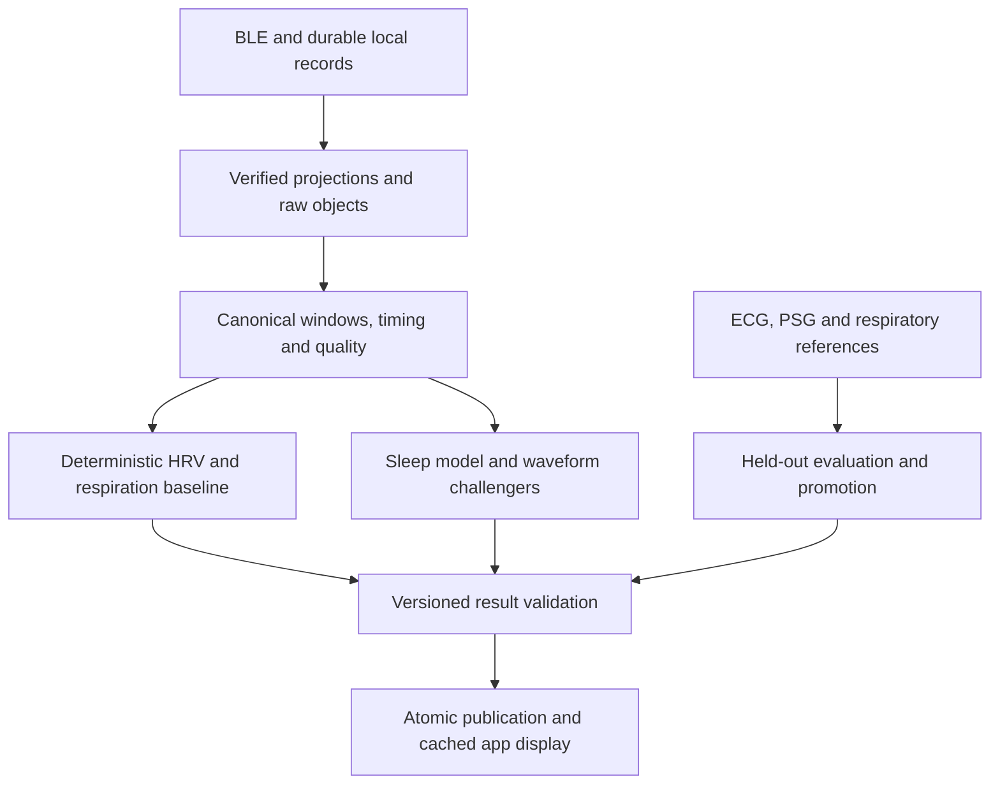

# naraWhoop: sleep, HRV and respiratory-rate upgrade

Research and implementation specification · 18 September 2026

## 1. Decision and scope

This is a substantial upgrade, not a two-prompt algorithm swap. First repair signal selection, scoring revisions and sleep persistence. Then build a shared quality-aware measurement pipeline, benchmark stronger models in shadow mode, and promote only against independent reference measurements.

More server capacity enables better temporal models, waveform processing and replay. It does not repair missing beats, establish bed occupancy, or make an incompatible pretrained model accurate on WHOOP.

In scope: WHOOP sleep/wake, naps, estimated four-stage sleep, five-minute HRV, respiratory rate, required signal quality, server execution and client presentation. Primary target is WHOOP 5; preserve existing device-family contracts. Steps may be consumed as an existing motion feature but step algorithms, calories, recovery-score redesign, apnea diagnosis and patient alerts are outside this pass.

Deliverables are this specification and the companion `AGENTS.md`. No repository code, GitHub issues, PRs, application databases or deployments were changed by this audit. An isolated SQLite reproduction confirmed the PPG schema conflict and same-second record loss. No native application, hardware, VPS or PSG benchmark was run. Findings below distinguish inspected behavior from proposed design and published evidence.

## 2. Source of truth and branch status

| Item | Inspected revision/status |
|---|---|
| Repository | https://github.com/kkakodka-bot/naraWhoop |
| Default `main` | `34fc950f03199b9d26e5019311394cb49cc34c7c` |
| PR 15 | Open, unmerged. `331f339bda78cc739c849cf3a43e3ba4a8722696`, based on `293fd6b84aa8f3e86f18cfab35933206aa53403d`, stacked on PR 14 |
| PR 16 | Open, unmerged. `5caa31689da0023e111beb36850d3f81d67e1be2`, based on the inspected `main` |
| Meaning of “current” below | PR 16 head, compared with PR 15 and main. This does not establish what is installed or deployed. |

[PR 15](https://github.com/kkakodka-bot/naraWhoop/pull/15) reports a PPG schema repair and hardware sync tests. [PR 16](https://github.com/kkakodka-bot/naraWhoop/pull/16) explicitly describes its cutover as accuracy-unproven, with overnight, Android and other acceptance items incomplete. Its server compiles the Android analytics sources into a JVM kernel; it does not introduce a newly trained sleep model.

The uploaded architecture, backend and algorithm documents are historical references. Some describe a retired Node server or an entirely offline app. Uploaded `ANALYTICS.md` describes Lipponen–Tarvainen correction, but this revision actually uses a Malik-style 20% local-median filter. Follow executable code and `CLAUDE.md`/`docs/SCOPE.md`, and update stale documentation during implementation. Do not resurrect the retired Node API.

## 3. What actually runs

The fork receives BLE data into local SQLite, exports through the Supabase push receiver to Postgres projections/B2, and adds server scoring in PR 16. `SignalSampleReader` loads HR, R–R intervals, respiration, gravity and events. `DayScorer` invokes the Kotlin `AnalyticsEngine` with `useSleepStagerV2=true`. `EngineIngestWriter` publishes server daily/session rows, then a derived archive is attempted. Swift/Android cache the server results for display. Live HR remains local.

| Area | Current implementation | Consequence |
|---|---|---|
| Sleep detection | Gravity/HR rules, event exclusions, session grouping and several fallback paths | A useful baseline, but some app-side inputs/fallbacks are absent from the server call. |
| Sleep stages | Thirty-second feature epochs and a fixed-coefficient cardiorespiratory HMM/Viterbi recipe | This is an untrained heuristic model with temporal smoothing, not a large learned classifier. |
| Nightly HRV | Per-session mean of five-minute RMSSD windows; daily aggregation weights session means by in-bed duration | Five-minute partitioning exists, but eligibility, continuity and weighting by actual usable evidence need correction. |
| “Current HRV” | A trailing 30-minute pooled RMSSD, refreshed after completed backfill | It is not the requested independent five-minute series. |
| WHOOP 5 respiration | Primarily respiratory sinus arrhythmia (RSA) from interval dynamics, interpolation, detrending and peak counting | This is not raw-PPG/IMU model inference. Narrow rate guards and weak confidence estimation limit coverage. |
| Server raw waveforms | The existing scoring reader does not load raw PPG/IMU objects | A waveform model requires a verified archive reader and signal adapter first. |

Continuous HRV capture is opt-in and defaults to an overnight-only 22:00–07:00 schedule, with battery-dependent pauses. A five-minute server scheduler cannot create the missing daytime beat data. Verify acquisition settings, actual interval coverage and device power behavior before promising the requested sampling frequency.

Preserve deterministic math, raw source retention, overcount rejection, existing cross-platform fixtures, source attribution, manual edits and the ability to compare/roll back estimators.

## 4. Confirmed findings and required repairs

Paths refer to PR 16 unless otherwise stated. Anchored source links appear in section 12.

| Priority | Finding and evidence | Required change |
|---|---|---|
| P0 | **PR 15's PPG compatibility repair is absent.** `WhoopStore/StreamStore.swift` writes `ON CONFLICT(deviceId, ts)` and omits `recordIndex`; PR 15 handles `(deviceId, ts, recordIndex)` and adds the compatibility migration/tests. PR 16 uses a different v46 migration. | Reconcile the specific repair and fixtures into the chosen baseline. Test both legacy and widened installed schemas. Preserve every record identity within a second. Do not blindly cherry-pick all of the older PR. |
| P0 | **Server R–R selection bypasses native safeguards.** `SignalSampleReader.loadRr` loads all channels and suspect timestamps. Native `Reads.swift` selects one verified WHOOP 5 transport, excludes legacy/unsupported streams and suspect timestamps. Metadata is loaded on the server but not used to enforce that policy. | Share an explicit canonical-source policy across server/native fixtures. First restore parity; evaluate finer per-window ownership separately. Never mix transports into one beat train. |
| P0 | **Successful rescoring exhausts the retry budget.** `ScoringWorkQueue.claimOne` increments `attempts`; `selectDue` caps it at 8. Neither success nor a new dirty revision resets it. | Count consecutive failures for a particular input revision separately from successful runs. New input must remain processable after arbitrarily many successful updates. Add fenced leases and revision-safe publishing. |
| P1 | **Five-minute HRV windows can contain only two cleaned intervals.** `SleepStager.sessionHrvWindows` checks `cleaned.nn.count >= 2`. The session-wide gate rejects overcounting but accepts undercoverage. | Require actual time coverage, continuous pair eligibility and sufficient clean observation duration per window. Distinguish sparse research estimates from a production five-minute metric. |
| P1 | **Array adjacency is not time continuity.** HRV paths compact values and lose timestamps; current-HRV uses an interval-only analyzer. Staging feature HRV also uses lightly filtered/raw successive differences. | Introduce one timestamp-aware beat/interval quality representation used by nightly, current and stage-feature calculations. Never form differences across packet loss, source changes or deleted beats. |
| P1 | **Missing sleep features become confident stages.** `SleepStagerV2.stageSessionUncached` emits all-light if features are empty, and carries the previous stage over interior gaps. | Emit `unknown` with reason and coverage; separate observed sleep/wake from inability to stage. Never count unknown as sleep by testing `stage != wake`. |
| P1 | **Daytime coverage and server context are incomplete.** `UserDayBounds` ends input at local midnight +12 elapsed hours; after-noon naps for that day are unavailable. `DayScorer` omits existing steps, band state, habitual timing and supplied/manual sleep inputs. Its motion-wake flag lacks required dense step input. | Use full-day event-time windows plus necessary session context, with DST-safe local calendar boundaries. Wire supported context deliberately; label unavailable inputs. Detect naps/shift sleep without a night-only assumption. |
| P1 | **Sleep projection changes meaning.** `EngineIngestWriter` hardcodes every session `is_nap=false`; chooses one longest session for bounds while daily totals can represent a grouped night. | Publish an explicit main-night group and separate nap/other episodes. Derive totals and bounds from the same set. Preserve unknown duration and manual edits. |
| P1 | **Derived identities are inadequate for revisioned scoring.** Daily key omits device while work is device-scoped; session upsert keyed by start time does not retire obsolete boundaries. Derived B2 key omits device/input revision. Read SQL pins `frwhoop-server-1`. | Persist device-scoped, revisioned outputs; atomically replace the generated episode set for its owner/window. Select one promoted version/source explicitly. Use immutable artifact keys and repairable archive status. |
| P1 | **Server stages do not survive client caching.** Swift `ServerScoreNightCache`/decoder omit the returned stage arrays; archive and database serializers duplicate incomplete mappings. | Use one canonical result DTO for publication/archive, then carry stages, probabilities, naps and missingness through both mobile caches and charts. |
| P1 | **Swift cache ownership is incomplete.** Server-score persistence/memory keys use day; sign-out clears auth but does not clear/hide cached overlays. | Scope caches to authenticated owner and selected device/source/version; hide or clear old-owner values and cancel in-flight requests on account switch. Test offline user switching. |

Also fix metric semantics during projection work: `overnight_hr_bpm` currently receives a lowest-five-minute resting-HR statistic. Give each statistic its correct name. Treat these as inspected defects/limitations, not proof of any individual user's runtime failure.

## 5. Target architecture and contracts

Keep Kotlin responsible for durable orchestration and canonical publication. Retain the current kernel as a versioned baseline. Add a bounded Python inference worker only where the selected signal-processing/model libraries justify it. It receives immutable inputs and returns versioned results; it does not independently publish competing daily records. Evaluate JVM ONNX Runtime if export preserves the selected model's behavior. No LLM sits on the measurement path.

Use the existing `noop_signal_windows` catalogue and object manifests for waveform discovery. Keep large raw PPG/IMU in B2 and compact windows/epochs in Postgres. A ready/client-claimed object or successful HEAD size check is not verified content: fetch bytes, validate the digest and decoding before inference.

### 5.1 Canonical data

Names below describe required fields, not a demand to create duplicate tables. Reuse and extend existing schema/RPCs where possible.

| Object | Required contract |
|---|---|
| Signal/beat provenance | User and physical device; family/firmware; decoder version; channel/transport; sensor timestamp and precision; arrival timestamp; packet sequence/record index/sample ordinal; clock-mapping version; continuity group; original value; units; quality flags. |
| Raw waveform segment | Verified object identity/hash; optical wavelength/channel where known; sample count and actual sample rate; timestamp reconstruction; IMU axis/orientation and units; clipping/contact/gap masks. Unknown channel semantics remain unknown. |
| Five-minute measurement | `[start,end)` event-time bounds; metric name/unit/modality; estimate or null; method/model/preprocess/quality-policy versions; input revision/hash; observed duration, accepted fraction, valid-pair count, maximum gap, correction fraction; source ownership; context probabilities; validity/reason. |
| Sleep epoch | Thirty-second UTC bounds; `p_wake,p_light,p_deep,p_rem` when supported; predicted stage or `unknown`; separately sleep/wake probability; evidence coverage; causal/retrospective mode; revision and abstention reason. Uncalibrated probabilities must be labelled as such. |
| Sleep episode | Stable identity, device, start/end, episode type (`main_sleep`, `nap`, `other_sleep`, `uncertain`), grouped-night ownership, revision, boundary provenance, manual-edit/tombstone status and quality. |
| Publication | User/device/period/input revision; run ID and lease token; immutable model manifest/hash; promoted/shadow state; observed-through time; computed time; provisional/final/superseded status; archive status. |

Do not reconstruct subsecond precision that the source cannot support. R–R slot order and tick conversion must be demonstrated with packet fixtures and paired captures. Equal successive numerical intervals are valid possible observations, not duplicate identities. Unknown legacy WHOOP 5 interval units must not be “fixed” by multiplying all history. Backfill from original bytes only where provenance supports a deterministic decoder migration; otherwise preserve and mark unavailable.

Do not assume the raw object lane contains uninterrupted, correctly decoded optical waveforms. Produce a per-user/night coverage inventory before choosing a waveform model. Check raw pruning against verified archival state where those records become model prerequisites.

Define quality denominators explicitly. `observed_time_fraction` is the union of verified observed time within the requested 300-second window divided by 300, not first-to-last sample span or the sum of duplicate intervals. A decoded beat stream may support that union only where packet timing/continuity establishes it. `valid_interval_fraction` is accepted original intervals divided by original observed intervals; `valid_pair_count` counts qualified successive-interval pairs. Record corrected original intervals, inserted/deleted events and all correction passes separately; never use the final pass's artifact count as cumulative correction burden. `maximum_gap` is the largest unobserved duration within the requested window, including its edges. Keep `measurement_valid` separate from `baseline_eligible` and its context-specific reason.

### 5.2 Time, ownership and scheduling

* Evaluate canonical HRV windows of 300 seconds aligned to UTC, half-open. Use event time, not phone arrival time. Window identity is stable across retries and time-zone changes.
* Trigger on durable data arrival with debounce/coalescing. Compute a window once sufficiently complete, and revise it when late records change its input hash. Persist attempted-but-unavailable windows with reasons.
* Do not rescore the entire historical corpus every five minutes. Cache immutable window features and invalidate the affected model dependency span, including a following wake day when preceding-night data arrives late.
* Separate online causal estimates from whole-night retrospective scoring. Offline models may use future context; online paths must not do so. Store this distinction and expected latency.
* Use IANA timezone plus event-time timezone history for episodes and display. Calendar-day boundaries must handle 23/25-hour DST days. A currently edited profile timezone must not silently reassign historical records.
* Five-minute measurement cadence is not a guarantee that iOS wakes or uploads every five minutes. Preserve BLE state restoration/durable backfill and best-effort background transfer; expose observed-through and freshness timestamps. The existing 45-second foreground push loop and earliest-background-start request are not a background SLA. [Apple background behavior](https://developer.apple.com/library/archive/documentation/NetworkingInternetWeb/Conceptual/CoreBluetooth_concepts/CoreBluetoothBackgroundProcessingForIOSApps/PerformingTasksWhileYourAppIsInTheBackground.html).

### 5.3 Quality, context and unusual values are different

Maintain three independent outputs:

1. **Measurement reliability:** Was the signal sufficiently observed and interpretable?
2. **State/context:** Sleeping, quiet awake, active, transition, off-body or uncertain?
3. **Personal deviation:** Is a reliable estimate unusual relative to comparable past observations?

Represent bed occupancy and phone use as optional context with their own provenance. Quiet wake is not proof of being in bed; wrist inactivity is not proof of sleep. “Scrolling” requires independently available evidence or a user annotation. General phone activity must not be assumed available to an iOS app. Optional self-reports improve context without pretending they are PSG labels.

## 6. HRV implementation

### 6.1 Measurement pipeline

1. Select one verified source per measurement window under the canonical source policy. Do not splice differing transports merely to increase coverage. Separate before/after-source-switch windows.
2. Establish continuity from packet/beat identity and timing. If continuity cannot be demonstrated, return `continuity_unverified`.
3. For raw PPG, compare NeuroKit2's MSPTDfast and Elgendi detectors with the strap's verified interval stream. Add waveform morphology, clipping/perfusion, detector disagreement and motion checks where the input exists. Absence of raw PPG means waveform SQI is unavailable, not perfect.
4. Benchmark an auditable Lipponen–Tarvainen implementation against the current Malik filter and censor-only processing. Preserve originals, corrected values, correction class/count and affected pairs. PPG does not establish ECG ectopy; use “rhythm ambiguity” rather than an arrhythmia diagnosis.
5. Compute observed-pair RMSSD only over genuinely consecutive accepted original intervals: each difference requires three consecutive accepted original beats. Preserve explicit pair masks. Corrected estimates are separately named/versioned and cannot reconstruct missing acquisition time. Never bridge removal/gap boundaries or smooth a tachogram merely to make time-domain RMSSD look plausible. Compute SDNN separately over its documented duration.
6. Gate measurement validity by observed duration, gap pattern, correction load and signal interpretability. Context separately determines baseline/summary eligibility; valid active/transition observations remain available. HRV features used to infer sleep must not require a sleep label first. A beat count alone cannot establish five-minute coverage. Determine thresholds on development participants and freeze them before test. For initial shadow experiments sweep 80%, 90% and 95% observed-time coverage, report valid-interval fraction independently, and compare multiple correction limits using error-versus-coverage curves. None is a validated WHOOP cutoff.

Preserve valid zero RMSSD; null is reserved for missing/unusable estimates. Log transforms need explicit zero handling. Keep RMSSD, SDNN, device, modality and window duration distinct. Apple Health SDNN must not enter an RMSSD baseline.

### 6.2 User-visible series and baseline

* **Five-minute HRV:** show eligible measurements, their context and gaps. Active/transition windows may be valid but do not enter a stable-rest comparison.
* **Nightly HRV:** primary statistic is the arithmetic mean of eligible five-minute sleep RMSSD windows. Also store median, distribution, accepted duration and the night's sampling coverage. Do not pool the entire night into one RMSSD. Initial shadow eligibility requires every observed epoch in that full window to have qualified binary sleep context, with unknown time handled by the independent coverage policy; onset/wake-crossing or mixed-context windows are retained as mixed and excluded from this summary. Quantify this exclusion and compare less restrictive prespecified policies on development data before freezing one. Define minimum whole-night representativeness before promotion, including coverage across the night rather than a dense early-night island.
* **Daytime resting HRV:** independent series and baseline. Keep naps distinguishable. Do not let a fragile “deep sleep” classifier be the only eligibility gate; stage-stratified summaries remain secondary until stage validation.
* **Personal baseline:** begin with positive log-RMSSD and robust median/MAD or quantiles over prior, context-matched valid observations. Store baseline version/window and effective sample count. Reset or explicitly bridge device/algorithm changes using overlap validation. Cold starts return insufficient baseline. Fit using past observations only.
* **High readings:** preserve high-quality unusually high or low values as deviations. Do not clip toward a baseline. Irregular pulse timing may be unsuitable for a recovery interpretation even when the optical recording is clean; retain the observation/reason.

HRV computation is cheap. The useful additional computation is beat-quality analysis, context recognition and calibration, not a large model replacing the RMSSD formula. Sources: [NeuroKit2 HRV](https://neuropsychology.github.io/NeuroKit/_modules/neurokit2/hrv/hrv_time.html), [artifact correction](https://neuropsychology.github.io/NeuroKit/_modules/neurokit2/signal/signal_fixpeaks.html), [Oura five-minute method](https://support.ouraring.com/hc/en-us/articles/360025441974-Heart-Rate-Variability), [simultaneous Oura/ECG study](https://pubmed.ncbi.nlm.nih.gov/39686012/).

## 7. Sleep and stage implementation

### 7.1 Separate detection, context and staging

First detect sleep/wake opportunities across the full 24 hours, including naps and shift sleep. Then establish episodes and stage eligible sleep periods. Train/evaluate quiet wake explicitly, including lying still, reading, phone use and fragmented sleep. Off-body and missing observations are distinct from wake.

Keep bedtime, estimated sleep onset, final wake, bed exit and user-edited boundaries separate. A wearable cannot establish all of them from inactivity alone. Report “resting/possibly awake” or uncertain boundaries where evidence is insufficient. Naps are episodes, not forced miniature overnight architecture.

Use four-class output: wake, light (N1+N2), deep (N3), REM, plus an abstention state. Do not infer N1 versus N2 without target evidence. No-feature epochs are unknown; uncertain staging may still support binary sleep/wake. Distinguish `sleep_unstaged` (qualified binary sleep, unknown stage) from `state_unknown` (sleep/wake unknown). Total estimated sleep equals light + deep + REM + sleep_unstaged; state_unknown contributes to neither sleep nor wake. Report both separately. Never infer sleep solely from `stage != wake`. If bed occupancy is unconfirmed, label the denominator as estimated sleep opportunity rather than measured time in bed.

### 7.2 Model comparison, in this order

| Candidate | Role/input | Why evaluate it | Constraint |
|---|---|---|---|
| Existing V2, repaired missingness | Frozen reference over current HR/IBI/gravity | Establish a reproducible baseline and expose regressions | Fixed heuristic, not proof of physiological accuracy. |
| Feature-based learner + duration-aware smoothing | Train LightGBM or a compact temporal model on real IBI/HRV, HR, available IMU/motion, timing and missingness | Best practical path with today's available signals; supports ablations and CPU deployment | Requires participant-disjoint PSG labels. Never train on the app's own stages as truth. |
| `wav2sleep` | Conditional raw-PPG four-stage challenger with released cardio-respiratory checkpoint | Credible heavy, open sequence model; supports PPG-only inference within its trained modalities | PSG pulse-oximeter domain is not WHOOP wrist. Whole-night context is retrospective. Requires correct resampling to its contract and gap-safe input adapter. |
| Walch `sleep_classifiers` | HR + wrist acceleration sleep/wake/three-state baseline | Reproducible sensor-relevant comparison | Not a drop-in four-stage classifier. |
| SleepECG | Beat-time two/three-class research baseline | Tests information available from beat features | ECG-trained, needs PPG-IBI transfer validation; does not supply deep/light separation. |

For `wav2sleep`, the inspected cardio-respiratory input is 1,024 samples per 30-second epoch, about 34.133 Hz. Its paper reports PPG-only held-out-person kappa of 0.742–0.832 across MESA, CHAT, CFS and CCSHS, after multi-dataset training. Those are not untouched external WHOOP cohorts or directly comparable to Apple's median kappa. Use its exact versioned preprocessing, units and channel vocabulary; do not feed BPM as PPG or insert IMU into a respiration channel. Its generic preprocessing interpolates missing samples and pads inputs, so enforce segment validity and abstention around gaps before model invocation. The newer EOG five-stage model is a different input problem and is not eligible without EOG. [Code and paper](https://github.com/joncarter1/wav2sleep).

Start waveform inference as a whole-night shadow run. Benchmark a compact CNN/TCN and the feature learner before accepting a heavier model. More parameters are not a release criterion. Evaluate SleepPPG-Net-family architectures only if code, weights and rights needed for reproduction are actually available; paper accuracy alone is insufficient. EEG/PSG models such as YASA, U-Sleep and SleepFM are not direct substitutes for WHOOP PPG/IMU input.

The existing `Tools/SleepPSG` benchmarks staging inside supplied PSG sleep windows, not end-to-end session detection, and its sleep-accel input lacks R–R intervals. Its reported roughly 0.36 kappa is a historical benchmark, not a WHOOP performance estimate. Adding R–R is not automatically an accuracy improvement. Extend the harness to test detection, wake specificity, naps, gaps and end-to-end publication separately.

### 7.3 Lessons from Apple, WHOOP and Oura

* Apple's October 2025 report describes an accelerometer-based sleep model designed to improve quiet-wake detection. Its median four-stage kappa was 0.68 on its original validation set and 0.66 on a clinical holdout. This supports careful training and validation, not copying an unavailable Apple model. Apple also separates short detected sessions from full-stage eligibility. [Apple technical report](https://www.apple.com/health/pdf/Estimating_Sleep_Stages_from_Apple_Watch_Oct_2025.pdf).
* Oura describes staging from movement, temperature, HR/HRV and temporal context, supported by device-paired PSG studies. Its 2024 Gen3 study's approximately 92% agreement is binary sleep/wake accuracy, not four-stage accuracy. Use multimodal evidence and frequent quality-qualified nocturnal HRV windows; do not assume a finger sensor and WHOOP wrist sensor have identical errors. [Oura algorithm](https://ouraring.com/blog/new-sleep-staging-algorithm/), [primary validation](https://pubmed.ncbi.nlm.nih.gov/38382312/).
* WHOOP describes PSG-trained staging from cardiac/respiratory and motion information, and sleep-time RSA for respiration. This supports the physiological approach, not the decoder, filters or accuracy of this fork. Public pages do not disclose complete scoring code/weights, and older-hardware studies do not establish WHOOP 5 performance. [WHOOP sleep methods](https://www.whoop.com/us/en/thelocker/how-well-whoop-measures-sleep/).

These vendor results are not directly rankable against one another or against `wav2sleep`: populations, inputs, label sets and aggregation statistics differ.

## 8. Respiratory-rate implementation

### 8.1 Baseline and quality

Keep R–R (interbeat interval, milliseconds) unambiguous from respiratory rate (breaths/minute) in APIs and field names.

Build a transparent baseline using available respiratory modulations: pulse interval/frequency (RSA), amplitude and baseline wander from raw PPG, plus validated IMU respiration where available. Use separate preprocessing branches: cardiac beat-detection filtering can erase slow respiratory modulation. Never estimate respiration by simply regressing mean heart rate.

Compare spectral and autocorrelation estimates, peak/harmonic alternatives and cross-channel agreement. Estimate periodicity strength, effective cycles, missingness and motion contamination. Fuse only validated, available channels; do not multiply correlated evidence as if independent. Abstain on weak/disagreeing signals and record why.

Initial engineering experiments: 60–120-second windows with 30/60-second stride and five-minute summaries, compared against 32/64-second alternatives. A lower respiratory frequency requires enough observed cycles. Each method's validated rate range and sampling/aliasing limits belong in its model card. The current 8–25 output guard is not a universal physiological range; do not clamp a faster true rate into normality or merely widen constants and call the problem solved.

Audit the meaning of every decoded respiration field before using it. A value named `respSample` or a 1 Hz auxiliary channel is not automatically a reference respiratory waveform. Classify unsupported rates as out-of-range, with raw evidence retained. Do not make apnea or breathing-pattern claims from a scalar respiratory-rate estimate.

### 8.2 Learned candidates and corrections to the attached library

| Candidate | Verified implementation/release | Decision |
|---|---|---|
| [RR_Estimation](https://github.com/kazemikianoosh/RR_Estimation) | MIT repository with `.h5` weights. Current released model uses 32 s at 64 Hz, PPG + three-axis acceleration, tensor `(2048,4)`. | Leading sensor-matched learned challenger, conditional on aligned raw inputs. This is not the same pipeline as the cited PPG+accelerometer+gyroscope/ICA paper. Inspect preprocessing/checkpoint provenance before inference. |
| [CorrEncoder](https://github.com/harryjdavies/correncoder_ppg_respiration) | MIT; inspected training script uses MSE, external presegmented MAT data and positional subject-fold assumptions; no released pretrained checkpoint found. | Reproduction/training experiment, not ready-to-run pretrained inference. The library's “correlation-aware released implementation” description is not established by the current script. |
| [RRest](https://github.com/peterhcharlton/RRest) | GPL toolbox for respiratory signal extraction, rate estimation and fusion | Transparent research comparator. Pin/test the relevant path; audited source includes reproduction issues. Its laboratory pulse-oximetry results are not free-living WHOOP wrist results. Do not assume a separate process resolves license obligations. |
| RespDiff and other heavier waveform models | Interesting published finger/hospital-PPG results, but release/licensing/reproducibility gaps remain | Optional later research. Not ahead of a matched-input, validated baseline simply because the network is larger. |

Nightly respiration should aggregate quality-eligible sleep estimates with accepted-time coverage, distribution and source/method. Prespecify mean versus median; use a median as the initial robust summary and retain the mean for comparison. Track awake-rest estimates separately. Public precedents: [WHOOP respiration](https://www.whoop.com/us/en/thelocker/what-is-respiratory-rate-normal/), [Oura respiration](https://support.ouraring.com/hc/en-us/articles/360025443174-Respiratory-Rate).

## 9. Production work packages

These are sequential issue-sized deliverables. Within each, agents can work on disjoint files behind agreed contracts. Proposed new paths are explicitly labelled; existing paths are repair seams, not an exhaustive file list.

### W0. Reconcile PRs and prove acquisition

**Existing seams:** `Packages/WhoopStore/{Database,StreamStore,Reads,Whoop5RRReadPolicy}.swift` under `Sources/WhoopStore/`; `Packages/WhoopProtocol/Sources/WhoopProtocol/Whoop5RR.swift`; Android twins; PR 15 compatibility tests; cloud raw export.

Pin a working baseline; reconcile PPG record identity without losing PR 16's interval/source migration. Produce packet-to-store-to-server parity fixtures and a signal-availability report with coverage, sample rate, channel identity and timing uncertainty. Measure daytime/sleep acquisition with the existing continuous-HRV settings, battery limits and background behavior. Change capture policy only through supported commands with real-hardware power/continuity tests. Preserve ACK-after-durable-commit behavior. Existing verified archives/backfill must remain usable.

**Acceptance:** widened/legacy SQLite schemas both ingest multiple same-second PPG records without loss; replay is idempotent; known WHOOP 5 ticks decode consistently; suspect/legacy/unsupported interval streams never enter the canonical scored train; missing raw waveforms disable only their dependent candidates. No blanket unit conversion of old rows.

### W1. Repair server orchestration and projections

**Existing seams:** `scoring-service/service/src/main/kotlin/com/frwhoop/scoring/db/{SignalSampleReader,ScoringWorkQueue,EngineIngestWriter}.kt`; `scoring/{DayScorer,ScoringPoller,UserDayBounds}.kt`; `derived/`; additive Supabase migrations/read RPCs.

Implement explicit input revisions, failure budget per revision, lease ownership tokens and conditional publication. Revisions/outbox records must commit transactionally with HR, intervals, respiration, gravity, off-wrist events, corrections, manual edits and verified raw-object availability. A polling watermark alone is insufficient for late commits/corrections. Do not publish a stale result and only then discover its inputs changed. Renew running leases; claim only work that can execute, rather than leasing a serial backlog in advance. Awaiting not-yet-arrived inputs is a waiting state, not a rapid failure-retry loop. Make dirtying dependency-aware across midnight and the full temporal receptive field. Persist per-device results and separately resolve the user's selected source. Replace the generated episode set atomically, preserving edits/tombstones. Correct nap flags and grouped-night totals.

Use immutable derived keys containing user/device/period/model/input revision or content hash, with independently retryable archive status. Existing Postgres scores may remain usable if archival fails, but cannot claim archive-verified. Prevent old retries overwriting newer projections. Add a promoted-version registry/config with feature-specific compatibility instead of hardcoding version 1 in reads.

**Acceptance:** more than 300 successive successful input revisions score; repeated failures for unchanged input back off and surface status; simultaneous workers/lease expiry/new input cannot publish stale output; late pre-midnight data updates the relevant following sleep episode; two devices cannot overwrite each other's measurements; moved/removed sleep boundaries leave no duplicate obsolete sessions; afternoon nap, DST and no-data cases are correct.

### W2. Shared windows, quality and HRV

**Existing seams:** `HRVAnalyzer.swift`, `CurrentHRV.swift`, `SleepStager.sessionHrvWindows`, staging HRV feature extraction and Kotlin equivalents. Server additions may use proposed `scoring-service/.../signals/` and `.../measurements/` modules.

Implement the contracts in sections 5–6 and a single reusable window result. Reuse tested deterministic logic where practical. Keep changed native fallback semantics aligned through shared golden fixtures; do not require porting a heavyweight Python model to the phone.

**Acceptance:** equal genuine intervals survive; zero RMSSD remains zero; duplicate records do not add beats; gaps/source switches do not create adjacency; sparse windows are unavailable; clean high variability survives; corrected and observed metrics have distinct provenance; stage features cannot bypass quality; nightly arithmetic equals eligible-window arithmetic; Apple SDNN cannot silently enter RMSSD series.

### W3. Full-day sleep and honest stage coverage

**Existing seams:** `SleepStager`, `SleepStagerV2`, `SleepStageTotals`, `HypnogramCoverage`, `AnalyticsEngine`, `DayScorer`, server sleep DTOs/readback, Swift `SleepModel`/`SleepView` and Android sleep UI.

Build independent sleep/wake, context and stage outputs; support full-day episodes; add unknown-stage handling through calculations, storage and UI. Extend `ServerScoreNightCache`, `ServerScoreClient`, Android equivalents and chart mapping to retain server epoch/stage arrays. Generate SQL and archive payloads from one DTO. Make caches owner-scoped, cancel stale-user fetches and perform an immediate correctly scoped refresh after sign-in. Wire only available context. Keep user corrections as provenance-bearing overrides, distinct from independently scored truth. Define main-sleep grouping and nap ownership deterministically without forcing a fixed bedtime.

**Acceptance:** gap/empty inputs never become all-light; sleep_unstaged can contribute to binary sleep totals while state_unknown cannot; stage/state totals reconcile with duration; actual server stages reach both apps; cached values from a prior user never appear after account switch, even offline; naps after noon survive publication; reading/phone-use fixtures do not automatically become sleep; quiet-wake errors are measured with labels; manual edits persist through rescoring; online inference does not read future samples.

### W4. Respiration and model adapters in shadow

**Proposed paths:** `scoring-service/inference/` for Python runtime if selected; `models/manifests/`; `Tools/physiology-bench/`. Adjust names to existing conventions before implementation.

Build verified raw-object reading, per-model resampling/masking, deterministic respiratory baseline and candidate adapters. Add `wav2sleep` and `RR_Estimation` first only if input contracts pass. Add CorrEncoder training reproduction as a separate experiment. One inference failure must not block independent HRV or other users' processing. Avoid nested thread pools; measure CPU, RAM, optional GPU, throughput and p95 latency on the actual VPS before setting concurrency. Repository provisioning requests 4 vCPU/8 GB with no GPU configuration; that is configuration evidence, not a verified live capacity inventory. Begin with bounded inference concurrency and leave resources for Postgres/ingestion.

**Acceptance:** model manifests pin code/checkpoints/hashes, licenses, preprocessing and allowed inputs; corrupt/gapped/wrong-channel data abstain; training and inference preprocessing match; outputs are strictly shadow; immutable inputs reproduce outputs within declared numerical tolerance; resource limits and timeouts isolate failures.

### W5. Reference validation, promotion and rollout

Extend the benchmark harness as specified below. Run shadow on prospective WHOOP data, publish a signed/versioned evaluation manifest, then enable a small opt-in cohort with per-feature rollback. Do not treat green tests, native/server parity or agreement with WHOOP/Oura as proof of accuracy.

**Acceptance:** all functional gates pass; reference cohort/splits and frozen metrics meet a prespecified accuracy/coverage budget; model and subgroup limitations are visible; server/local/shadow sources are unambiguous; previous model remains available; a full-night locked-phone/background/backfill soak passes on actual hardware. Implementation can be complete while validation remains pending. Report those statuses separately.

## 10. Validation required before an accuracy claim

### Ground truth and split discipline

| Target | Primary reference | Required evaluation |
|---|---|---|
| Sleep stages and sleep/wake | Synchronized PSG with scored 30 s epochs | Four-stage confusion, macro-F1, Cohen kappa, each-stage precision/recall; wake specificity and sleep sensitivity; calibration; coverage. |
| Episode detection/naps | PSG where available plus independently timestamped sleep opportunity/behavior annotations | Onset/offset error, TST, WASO, latency, nap precision/recall and false episodes per day. Bed occupancy/phone use need their own labels. |
| HRV | Simultaneous ECG with adjudicated R peaks and usable NN reference | Beat timing/precision/recall; five-minute RMSSD bias, MAE, limits of agreement; nightly error; valid-time coverage and correction burden. |
| Respiration | Synchronized airflow/capnography or validated respiratory effort reference | MAE/RMSE, bias/limits of agreement, within-2-breaths/min fraction, rate-range/motion strata and valid coverage. Waveform claims require waveform reference. |

Split by person before windowing; reserve future nights and an external device/site cohort where feasible. Fit normalization, thresholds, calibrators and model selection only inside training/development. Purge overlapping sequence context across splits. Bootstrap uncertainty by participant, not individual correlated epochs. Record label uncertainty and scorer agreement. Vendor imports may be comparison data, not primary labels.

Include intended-use age groups, disease/medication contexts, skin tone/perfusion, arrhythmia-like pulse irregularity, low HR, fast/slow breathing, fragmented sleep and sensor-placement/firmware changes. Adult models must not silently inherit pediatric claims. Prospective cohort size and reference collection depend on the intended population and a power analysis; a small convenience pilot establishes feasibility only.

### Selection rule

Before examining held-out results, commit a `promotion-policy` with the primary metric, clinically/operationally meaningful improvement, noninferiority margins for wake detection and coverage, maximum subgroup regressions, and resource budget. The audit cannot honestly invent WHOOP-specific validated accuracy cutoffs without these data.

Compare every candidate with the repaired baseline on identical participants, eligible time and censoring rules. Report both common-window accuracy and native accepted coverage; present risk-versus-coverage curves. A model cannot win by dropping the difficult nights. For stages, include end-to-end detection rather than only PSG-preselected sleep windows. For HRV, stratify clean high-variability windows to detect overfiltering. For respiration, verify harmonic errors and out-of-supported-range behavior.

Keep engineering gates and scientific gates separate. Training adapters, manifests, tests and a reproducible benchmark are buildable now. Demonstrating target-device accuracy requires synchronized reference data and cannot be completed by an LLM prompt alone.

## 11. Product behavior and remaining opportunity

Show last observed time, processing state, selected source/model, valid coverage and a concise reason when a value is unavailable. Retain last-known data with its timestamp; do not disguise stale data as current. Freshness compares the required input revision/observed-through time for active periods; a finalized historical night does not become invalid merely because it was computed more than six hours ago. Server mode must expose sign-in/configuration failure rather than silently leaving a blank after local rescoring is disabled. Any local fallback is explicitly attributed.

The strongest remaining opportunities are quiet-wake/nap recognition, genuinely reliable frequent HRV, explicit gaps, context-matched personal trends, raw-waveform transfer to WHOOP, and validation in the actual patient population. These improve trust and usable coverage. They are more defensible than claiming a larger network reproduces proprietary WHOOP, Oura or Apple accuracy.

LLMs may later parse user sleep-journal text into reviewable structured annotations or explain already-computed results. They must not assign stages from prose, repair missing beats, invent respiratory values or decide signal quality. That optional journal work is outside the critical build path.

## 12. Inspectable sources

### Repository evidence

All links below are pinned to the reviewed code, except PR pages whose status can change.

* [PR 15 PPG writer](https://github.com/kkakodka-bot/naraWhoop/blob/331f339bda78cc739c849cf3a43e3ba4a8722696/Packages/WhoopStore/Sources/WhoopStore/StreamStore.swift) and [PR 16 writer](https://github.com/kkakodka-bot/naraWhoop/blob/5caa31689da0023e111beb36850d3f81d67e1be2/Packages/WhoopStore/Sources/WhoopStore/StreamStore.swift).
* [Native R–R selection](https://github.com/kkakodka-bot/naraWhoop/blob/5caa31689da0023e111beb36850d3f81d67e1be2/Packages/WhoopStore/Sources/WhoopStore/Reads.swift), [server input reader](https://github.com/kkakodka-bot/naraWhoop/blob/5caa31689da0023e111beb36850d3f81d67e1be2/scoring-service/service/src/main/kotlin/com/frwhoop/scoring/db/SignalSampleReader.kt).
* [Queue claims/retries](https://github.com/kkakodka-bot/naraWhoop/blob/5caa31689da0023e111beb36850d3f81d67e1be2/scoring-service/service/src/main/kotlin/com/frwhoop/scoring/db/ScoringWorkQueue.kt), [scorer call](https://github.com/kkakodka-bot/naraWhoop/blob/5caa31689da0023e111beb36850d3f81d67e1be2/scoring-service/service/src/main/kotlin/com/frwhoop/scoring/scoring/DayScorer.kt), [day bounds](https://github.com/kkakodka-bot/naraWhoop/blob/5caa31689da0023e111beb36850d3f81d67e1be2/scoring-service/service/src/main/kotlin/com/frwhoop/scoring/scoring/UserDayBounds.kt).
* [HRV cleaning](https://github.com/kkakodka-bot/naraWhoop/blob/5caa31689da0023e111beb36850d3f81d67e1be2/Packages/StrandAnalytics/Sources/StrandAnalytics/HRVAnalyzer.swift), [current HRV](https://github.com/kkakodka-bot/naraWhoop/blob/5caa31689da0023e111beb36850d3f81d67e1be2/Packages/StrandAnalytics/Sources/StrandAnalytics/CurrentHRV.swift), [session HRV and respiration](https://github.com/kkakodka-bot/naraWhoop/blob/5caa31689da0023e111beb36850d3f81d67e1be2/Packages/StrandAnalytics/Sources/StrandAnalytics/SleepStager.swift).
* [V2 stage model/gap behavior](https://github.com/kkakodka-bot/naraWhoop/blob/5caa31689da0023e111beb36850d3f81d67e1be2/Packages/StrandAnalytics/Sources/StrandAnalytics/SleepStagerV2.swift), [sleep projection](https://github.com/kkakodka-bot/naraWhoop/blob/5caa31689da0023e111beb36850d3f81d67e1be2/scoring-service/service/src/main/kotlin/com/frwhoop/scoring/db/EngineIngestWriter.kt), [existing PSG harness](https://github.com/kkakodka-bot/naraWhoop/tree/5caa31689da0023e111beb36850d3f81d67e1be2/Tools/SleepPSG).
* [Server schema](https://github.com/kkakodka-bot/naraWhoop/blob/5caa31689da0023e111beb36850d3f81d67e1be2/supabase/migrations/20260916160000_scoring_service_state.sql), [readback/version pin](https://github.com/kkakodka-bot/naraWhoop/blob/5caa31689da0023e111beb36850d3f81d67e1be2/supabase/migrations/20260917180000_server_score_user_reads.sql), [derived artifact key](https://github.com/kkakodka-bot/naraWhoop/blob/5caa31689da0023e111beb36850d3f81d67e1be2/scoring-service/service/src/main/kotlin/com/frwhoop/scoring/derived/DerivedArtifactKey.kt).
* [Server cache ownership](https://github.com/kkakodka-bot/naraWhoop/blob/5caa31689da0023e111beb36850d3f81d67e1be2/Strand/Push/ServerScoreRepository.swift), [stage decoder](https://github.com/kkakodka-bot/naraWhoop/blob/5caa31689da0023e111beb36850d3f81d67e1be2/Strand/Push/ServerScoreClient.swift), [continuous-HRV settings](https://github.com/kkakodka-bot/naraWhoop/blob/5caa31689da0023e111beb36850d3f81d67e1be2/Strand/BLE/PuffinExperiment.swift), [provisioned host shape](https://github.com/kkakodka-bot/naraWhoop/blob/5caa31689da0023e111beb36850d3f81d67e1be2/infra/vps/scripts/provision-droplet.sh).

### External code and methods

* [wav2sleep repository](https://github.com/joncarter1/wav2sleep), [cardio-respiratory model](https://huggingface.co/joncarter/wav2sleep), [paper](https://arxiv.org/html/2411.04644v1). Inspected code revision: `278e30463c8149c4e6899b8784da492fec695bd9`; MIT. The checkpoint card at model revision `8b6e46ab3ef6e3945282b81f631933c59db0b205` also states MIT and explicitly noncausal inference. Record the downloaded weight hash and applicable training-data terms separately.
* [Walch sleep classifiers](https://github.com/ojwalch/sleep_classifiers); [SleepECG](https://github.com/cbrnr/sleepecg), BSD-3-Clause.
* [NeuroKit2](https://github.com/neuropsychology/NeuroKit), MIT; [PPG detectors](https://neuropsychology.github.io/NeuroKit/_modules/neurokit2/ppg/ppg_findpeaks.html), [quality measures](https://neuropsychology.github.io/NeuroKit/_modules/neurokit2/ppg/ppg_quality.html).
* [HeartPy](https://github.com/paulvangentcom/heartrate_analysis_python), MIT; [algorithm details](https://python-heart-rate-analysis-toolkit.readthedocs.io/en/latest/algorithmfunctioning.html). Its variability-minimizing peak selection and default HR bounds require scrutiny. [pyHRV](https://github.com/PGomes92/pyhrv), BSD-3-Clause, is a numerical-feature comparator rather than a complete acquisition/quality solution.
* [Apple heartbeat series and SDNN](https://developer.apple.com/videos/play/wwdc2019/218/); [WHOOP HRV explanation](https://www.whoop.com/us/en/thelocker/heart-rate-variability-hrv/). Copy comparable measurement context, not undisclosed proprietary weighting.
* [SleepFM clinical repository](https://github.com/zou-group/sleepfm-clinical): PSG modality mismatch and CC BY-NC 4.0 terms prevent treating it as the preferred direct commercial wrist-model dependency. [RespDiff](https://github.com/MYY311/RespDiff) lacks verified released weights/license in this audit.
* [PostgreSQL queue locking](https://www.postgresql.org/docs/current/sql-select.html), [ONNX Runtime thread management](https://onnxruntime.ai/docs/performance/tune-performance/threading.html): implementation references for bounded server execution, not physiological validation.

Every external dependency requires a pinned release/commit, checkpoint hash, separate code/weights/data license check and a local input/output reproduction. Public availability alone is not permission or evidence of target-device accuracy.
