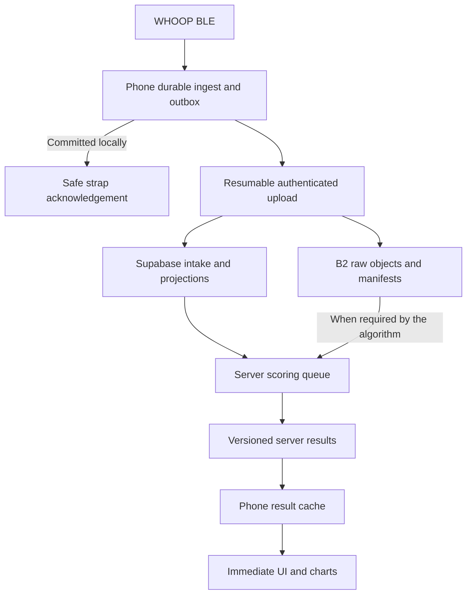

# FRWHOOP production sync and server computation specification

Repository: https://github.com/kkakodka-bot/naraWhoop  
Audit date: 18 September 2026  
Status: implementation specification, not an assertion that production is fixed.

## 1. Decision and evidence boundary

This requires a coordinated change across BLE ingestion, account identity, background uploads, server scheduling, result storage, and app rendering. PR 16 is a useful starting point, but it does not complete the requested server-computation architecture and does not include PR 15's ingestion fixes.

Keep a durable phone upload buffer and a small cache of server results. Move sustained analytics and history processing to the server. Removing all local persistence would make safe BLE acknowledgements, offline capture, restart recovery, and instant display impossible. Local persistence is a transport and presentation requirement; it need not be a permanent duplicate of the complete cloud history.

Six agents reviewed separate areas. Findings were checked against the following pinned revisions:

| Reference | Revision | State observed |
|---|---|---|
| `main` | `34fc950f03199b9d26e5019311394cb49cc34c7c` | Current default branch at inspection |
| PR 14 | `293fd6b84aa8f3e86f18cfab35933206aa53403d` | Open; offload correctness fixes |
| [PR 15](https://github.com/kkakodka-bot/naraWhoop/pull/15) | `331f339bda78cc739c849cf3a43e3ba4a8722696` | Open; based on PR 14 |
| [PR 16](https://github.com/kkakodka-bot/naraWhoop/pull/16) | `5caa31689da0023e111beb36850d3f81d67e1be2` | Open; based on main; includes PR 17's derived artifact work |

PRs 14/15 and 16 are separate development lines. Neither PR 15 commit is an ancestor of PR 16. Recheck these references before implementation, because this document describes these exact revisions.

The 16 supplied attachments were assigned across the audits as historical context. They describe multiple generations of the product. In particular, `backend.md.txt` describes the retired Node backend. Current `CLAUDE.md`, `docs/SCOPE.md`, code, and migrations take precedence. Current scope documentation still describes an owner-only, locally computed companion; update that documentation as the requested multiuser/server architecture is implemented.

This was a source audit, not a connection to the attached iPhone, Xcode, production database, B2 account, or DigitalOcean host. PR 15's reported build-335 recovery of 1,033 chunks and 261 passing tests is author-reported evidence, not a run reproduced here. PR 16 explicitly leaves overnight validation and several deployment gates incomplete. A local Gradle test attempt was blocked while downloading Gradle 8.7 by network restrictions. No JVM, iOS, or production integration suite is claimed to have passed in this audit.

## 2. How the repository currently works

| Component | Current responsibility |
|---|---|
| `Packages/WhoopProtocol`, `Strand/BLE`, `Strand/Collect` | BLE protocol, decoding, historical offload and acknowledgement |
| `Packages/WhoopStore` | Local SQLite/GRDB samples, migrations, durable sync jobs, and PR 16's server score cache |
| `Strand/System/SyncEngine.swift` | Orders post-offload scoring, upload, HealthKit writeback and widget publication |
| `Strand/Push`, `Packages/NoopPush` | Snapshot export, upload cursors, periodic/background scheduling, HTTP push and binary objects |
| `supabase/functions/push`, `_shared` | Authenticated intake, WAL/idempotency, projections and B2 object completion |
| `supabase/migrations` | Supabase tables, RLS, RPCs, queues and server-result schemas |
| `scoring-service` in PR 16 | JVM service using an extracted Kotlin analytics kernel; reads `noop_*` projections and writes server HRV/sleep results |
| `infra/vps` in PR 16 | DigitalOcean provisioning/deployment scripts, self-hosted Supabase stack, scorer and backups |
| `Strand/Screens`, `StrandiOS`, `android` | Native UI and platform lifecycle; substantial local analytics remain |

PR 16's deployment model puts Supabase and the scorer on the VPS, with B2 as external object storage. Supabase is therefore not necessarily a separate hosted cloud after migration. The actual running endpoint, database, image digest, and app build must be verified. The scorer currently consumes PostgreSQL projections, not all B2 raw objects. Its writer persists HRV/sleep fields; it deliberately omits Charge/Effort/Rest, despite the kernel calculating some of them internally.

The requested target is:

## 3. Verified defects and their significance

References below point to PR 16 unless explicitly marked PR 15. They identify static code behavior; whether a particular user's installed build encounters it requires runtime evidence.

| ID | Priority | Finding and effect | Evidence |
|---|---|---|---|
| F1 | P0 | PR 16 lacks PR 14/15 offload fixes. Installing the server branch alone does not repair the known ingest failure. | Git ancestry; PR 15 and PR 16 references above |
| F2 | P0 | The old PPG writer uses `(deviceId, ts)` while some installed research databases use `(deviceId, ts, recordIndex)`. SQLite rejects the conflict target, the mixed chunk rolls back, and ACK is withheld. This explains a concrete installation-dependent stall; a fresh database may behave differently. | [Old StreamStore](https://github.com/kkakodka-bot/naraWhoop/blob/5caa31689da0023e111beb36850d3f81d67e1be2/Packages/WhoopStore/Sources/WhoopStore/StreamStore.swift), PR 15 `v46-ppg-record-identity` and `PpgSchemaCompatibilityTests.swift` |
| F3 | P0 | Upload credentials are shared across every installation; score reads use a separate user login. Data uploaded under the fleet token's owner can be invisible to another user's own-account readback. | [CloudPushSettings.swift](https://github.com/kkakodka-bot/naraWhoop/blob/5caa31689da0023e111beb36850d3f81d67e1be2/Strand/Push/CloudPushSettings.swift#L5-L7), lines 77–81; `_shared/tokens.ts:63–91`; `CloudAuthClient.swift` |
| F4 | P0 | Each scorer claim increments `attempts`, success never resets it, and subsequent claims require `<8`. After eight successful processing cycles, another update to that same device/day becomes permanently unclaimable. Uploads can continue while displayed scores freeze. | [ScoringWorkQueue.kt](https://github.com/kkakodka-bot/naraWhoop/blob/5caa31689da0023e111beb36850d3f81d67e1be2/scoring-service/service/src/main/kotlin/com/frwhoop/scoring/db/ScoringWorkQueue.kt#L91-L128), 158–197, 254–264 |
| F5 | P0 | Scorer completion/failure updates are not fenced by the worker's current claim. An expired worker can clear a newer claim or publish old results. A batch of eight jobs is leased before sequential processing, increasing expiry exposure. | `ScoringWorkQueue.kt:91–147`; `ScoringPoller.kt:45–53,76–108` |
| F6 | P0 | Server scoring defaults on and suppresses automatic local scoring based only on the toggle, even without configuration or sign-in. Server output does not replace every disabled local metric. | [ServerScoringSettings.swift](https://github.com/kkakodka-bot/naraWhoop/blob/5caa31689da0023e111beb36850d3f81d67e1be2/Strand/Push/ServerScoringSettings.swift#L14-L29); `SyncEngine.swift:134–139`; `EngineIngestWriter.kt:24–65` |
| F7 | P0 | Score cache keys omit account/environment. Sign-out does not clear or hide the cache; an in-flight response can also arrive after an account change. This risks showing the wrong person's cached results. | `ServerScoreCache.swift:177–218`; `ServerScoreRepository.swift:33–42,65–101` |
| F8 | P1 | Readback starts only under a launch-time condition tied to a local `repo.today`. Sign-in calls refresh with no day, so does no fetch. Polling retains its original day. Today only partially overlays server scores; Sleep remains driven by local sessions. Nested score-repository changes lack direct observation by these screens. | [ServerScoreRepository.swift](https://github.com/kkakodka-bot/naraWhoop/blob/5caa31689da0023e111beb36850d3f81d67e1be2/Strand/Push/ServerScoreRepository.swift); `AppModel.swift:423–425`; `TodayView.swift`; `SleepView.swift` |
| F9 | P1 | Both upload sessions are ephemeral `URLSession`s. A 30-minute timeout does not grant 30 minutes of iOS background execution. Timers and BGTask backstops alone cannot guarantee uploads survive suspension. Wi-Fi-only defaults on. | [CloudPushTransport.swift](https://github.com/kkakodka-bot/naraWhoop/blob/5caa31689da0023e111beb36850d3f81d67e1be2/Strand/Push/CloudPushTransport.swift#L176-L191); `CloudPushSettings.swift:82–85` |
| F10 | P1 | Binary completion marks the manifest ready before writing its signal-window index. If indexing fails, a completion retry returns immediately for the ready object and never repairs the missing index. | [objects.ts](https://github.com/kkakodka-bot/naraWhoop/blob/5caa31689da0023e111beb36850d3f81d67e1be2/supabase/functions/_shared/objects.ts#L296-L333) |
| F11 | P1 | Heavy local work remains: Today reads up to 200,000 HR points and calculates strain; main-actor repository paths merge/sort sample arrays; score-cache database reads/writes are synchronous on the main actor. These are credible hitch/heat risks, not measured timings. | `TodayView.swift:4917–4922`; `Repository.swift:1141–1156`; `ServerScoreRepository.swift:65–101`; `ServerScoreCache.swift:184–218` |
| F12 | P1 | Record retention and identity are incomplete end to end. PR 15 preserves PPG record identity locally, but export must also carry it. The rejected-frame archive is a capped diagnostic corpus with eviction, not a lossless upload buffer. | PR 15 `StreamStore.swift`, `HistoricalStreams.swift`, `RawHistoryArchive.swift:147–151,191–202`, `BLEManager.swift:3983–3994` |
| F13 | P0 | Waveform/auxiliary rows, raw batches and IMU files can be pruned without checking cloud acknowledgement. A long offline or Wi-Fi-only backlog can lose its upload source. | `StreamStore.swift:585–607`; `RawOutbox.swift:248–267`; `ImuContinuousRecorder.swift:440–457` |
| F14 | P0 | Server RR reads preserve source labels but do not apply the phone's eligibility rules. Legacy/mixed-unit rows, competing transports and suspect timestamps can enter server HRV despite exclusion on the phone. | [SignalSampleReader.kt](https://github.com/kkakodka-bot/naraWhoop/blob/5caa31689da0023e111beb36850d3f81d67e1be2/scoring-service/service/src/main/kotlin/com/frwhoop/scoring/db/SignalSampleReader.kt#L174-L199) versus `WhoopStore/Reads.swift:362–383` |
| F15 | P1 | Server input orchestration omits the app's HR-only sleep fallback and uses a fixed noon cutoff. The output mapper combines longest-session in-bed time with grouped sleep totals, which can produce negative awake minutes; all mapped sessions are marked non-naps. | `DayScorer.kt:19–42`; `UserDayBounds.kt:24–27`; `IntelligenceEngine.swift:1235–1262`; `EngineIngestWriter.kt:25–29,67–94` |

An isolated SQLite fixture reproduced F2's conflict-target failure and rollback of another sensor insert in the same transaction; the corrected key retained two same-second records under duplicate replay. An executed state-transition model reproduced F4: updates 1–8 succeed; update 9 remains pending with `attempts=8` and cannot be claimed. These were not on-phone or PostgreSQL integration tests. The corresponding suites must reproduce them against the actual components during implementation.

Additional correctness requirements: output keys currently collapse different devices into a user/day/version result, although jobs are device-specific; sleep upserts need a replacement policy for obsolete sessions; invalidation must include every input and affected overnight window. Address these in the server-result contract rather than allowing last-writer behavior to define source selection.

## 4. Responsibility and persistence contract

| Location | Must do | Must avoid |
|---|---|---|
| Phone | BLE connection/restoration, framing/CRC, minimal decoding needed for durable identity and live HR, transactional storage/outbox, file upload preparation, cached presentation and bounded UI transforms | Automatic whole-history rescoring, sleep staging, large HR array scans during rendering, per-frame UI publication, permanent unbounded duplicate raw history |
| DigitalOcean scorer | Derived metrics, baselines, sleep stages, feature extraction, chart aggregation, correction/replay and versioned result generation | Trusting client-supplied user identity; silently combining incompatible sources or units |
| Supabase/Postgres | Auth/ownership, intake receipts, queryable projections, work queues, result revisions, lightweight indexed snapshot reads and availability | Serving unbounded raw histories to build a dashboard; treating missing physiology as zero |
| B2 | Raw waveform/IMU archives, immutable source objects and versioned derived artifacts with manifests | Acting as a live chart API; claiming an object is recoverable because only a local upload intent exists |

Define a stream coverage matrix in the implementation: HR, RR, respiration, temperature, SpO2/candidate provenance, gravity, steps, PPG waveforms, v18 auxiliary values, raw IMU, events and undecoded records. For each, record producer, identity, time/unit semantics, transport, receipt, canonical storage, scorer usage and retention. The dashboard being populated is not evidence that all source streams reached durable storage.

For each supported historical chunk, decoded rows, rejected sensor frames where present, and durable upload debt must survive a crash before ACK. A successful SQLite commit can authorize strap ACK; a network response must never be required on the BLE critical path. Unknown sensor formats should be preserved in a durable quarantine lane without pretending they are decoded metrics. Establish an explicit policy for irrelevant console traffic separately.

Keep unacknowledged uploads until a verifiable server durability receipt exists. For raw object payloads, require object verification and manifest association. A transient HTTP 2xx or `computed_at` timestamp is not a deletion receipt. Track intake acceptance, archive verification and derived processing separately.

Proposed initial retention policy: at least 72 hours of ordinary offline buffering capacity, 14 days of compact score/sleep/chart cache, and eviction of confirmed-uploaded raw data after a short measured recovery grace period. These are product defaults to size and validate, not Apple requirements. Unsent data is not evicted just because its TTL expired. Low disk must produce visible backpressure, protect the outbox, and stop ACKing data that cannot be safely retained. Stop optional high-rate research capture before sacrificing essential records. Account deletion remains a separate explicit lifecycle.

## 5. Implementation work packages

### W0. Establish one integrated baseline and collect incident evidence

**Owner:** integration lead. **Depends on:** none.

1. Re-read live PR metadata and diff current heads. Build an isolated integration branch containing the required changes from PRs 14 and 15 plus PR 16. Preserve all existing migration names and install histories. PR 15's `v46-ppg-record-identity` and PR 16's `v46-rr-source-index` are distinct identifiers, despite sharing a numeric prefix. Do not resolve migration conflicts by deleting an applied migration or resetting the app container.
2. Record app version/build/Git SHA, DB migrations and actual PPG primary key, endpoint host, authenticated account ID, ingest-owner mapping, feature flags, permissions and network policy for one affected and one unaffected installation. Record server image digest/SHA, Edge revision, migration ledger, scorer heartbeat and cron status. Redact credentials.
3. Use the connected phone through the implementer's local Xcode session. Capture the first stalled boundary: last BLE record, local commit/ACK, oldest pending upload, last accepted receipt, indexed input revision, pending scorer item, result revision and displayed revision. Keep timestamps in UTC plus the relevant day timezone.
4. Make existing acceptance scripts fail when required deployment evidence is skipped. A file existing, a heartbeat row existing, or a script printing completion is insufficient. Verify advancing heartbeats and a newly ingested canary reaching visible results.

**Acceptance:** the integrated commit demonstrably contains both feature lines; fresh, legacy and research-schema databases open without loss; incident evidence identifies the actual stalled stage before anyone claims a production root cause. No production reset or unconditional full-history replay.

### W1. Repair BLE/history correctness and preserve record identity

**Owner:** ingest agent. **Depends on:** W0 branch integration.

Primary files: PR 15's `Packages/WhoopStore/{Database,StreamStore}.swift`, `Packages/WhoopProtocol/.../HistoricalStreams.swift`, `Strand/BLE/BLEManager.swift`, backfill/offload pipeline and `RawHistoryArchive.swift`.

1. Retain the PR 14/15 fixes: serialized frame processing, session generation fences, atomic session start, watchdog pause during chunk persistence and re-arm after ACK, installed PPG schema compatibility and conservative frontier handling. Make the unsafe timestamp-only range skip unreachable in production, including installations with an explicitly persisted `true` preference; changing the default alone is insufficient.
2. Preserve `(device, timestamp, recordIndex)` throughout local storage, push payloads, object codec, indexes and server replay. Unknown legacy identity uses an explicit unknown value, not an invented strap sequence number. Test multiple genuine records in one second.
3. Wait for required notification subscriptions and a ready durable store before requesting history; replace fixed-delay assumptions with state transitions and a bounded recoverable timeout. Select restored peripherals by registered active source, not array order. A restored pending connection is not proof of an encrypted ready session. Repeated disconnect/connect cycles must not duplicate the active offload or allow an old session to ACK a new one.
4. Separate lossless rejected-sensor quarantine from the diagnostic sample archive. Persist/upload before trimming the only remaining copy. An archive cap must not silently turn a failed preservation into success.
5. Bound batches and UI progress notifications. Defer optional archival compression and diagnostic work off the BLE callback/main thread while retaining the ACK durability contract.
6. Replace acknowledgement-unaware pruning in `StreamStore.swift:585–607`, `RawOutbox.swift:248–267` and `ImuContinuousRecorder.swift:440–457`. Add durable receipt associations for waveform/auxiliary/IMU objects, not just raw batches. Test every cap with uploads disabled and data still pending; previously durable unsent records must survive subsequent ingestion.

**Acceptance:** replay shuffled/duplicate/mixed sensor chunks; fail the PPG insert; kill after local commit but before ACK; disconnect during commit; deliver a late callback from an old session; delay required subscriptions; fill the quarantine volume. No silent dropped supported record, duplicate logical record or early ACK. Keep unknown sensor frames recoverable. Run on both legacy and widened PPG schema fixtures.

### W2. Unify account identity and make cloud state account-safe

**Owner:** identity/transport agent. **Depends on:** W0; may run alongside W1/W3.

Primary files: `CloudPushSettings.swift`, `CloudAuthClient.swift`, `CloudPushWorker.swift`, `_shared/tokens.ts`, server-score cache migrations and repositories; equivalent Android paths.

1. Bind uploads to the signed-in account and owned device through validated user JWTs or server-issued, scoped/revocable per-device ingest credentials. Remove the shared fleet bearer from ordinary multiuser builds. Audit existing fleet-owned records against verifiable person/device mappings; quarantine ambiguous ownership instead of bulk relabelling. Keep any explicit owner-only legacy path isolated during migration, then rotate/revoke its shared credentials after compatible cutover.
2. Account ID comes from server-validated credentials. Do not disable RLS or use a service-role key on the phone to make reads work. Verify upload and readback address the same project and ownership namespace.
3. Namespace upload cursors, pending payloads, authenticated sessions and result caches by environment/project, account and device/source where applicable. Cache keys also include day/timezone contract and algorithm/result version. Pin pending uploads to the account that created them; do not reassign an old user's queued data when another user logs in.
4. On logout/account/environment change: cancel or fence in-flight operations, immediately remove old data from presentation, and discard stale responses. Retain pending records under their original owner for an explicit recovery path.
5. Serialize refresh-token exchanges. Treat timeout/429/5xx as retryable; do not clear a valid refresh session on every non-200 response. Handle locked-device credential accessibility deliberately. Do not log tokens, passwords or record payloads.
6. For managed-to-self-hosted migration, preserve user UUID/device mappings, move required data and objects, update endpoints/API keys, and require reauthentication when signing keys differ. Do not assume database restore migrates Edge functions or object bytes. See [Supabase's restore guide](https://supabase.com/docs/guides/self-hosting/restore-from-platform) and [session semantics](https://supabase.com/docs/guides/auth/sessions).

**Acceptance:** two users with distinct devices can upload and read only their own data; user A → logout → user B never displays or uploads A's records as B; old in-flight responses are ignored; endpoint switch creates a separate namespace; transient auth outage recovers without forced logout. Prove RLS with authenticated user-level requests.

### W3. Make intake and scoring survive retries, crashes and late data

**Owner:** server agent. **Depends on:** W0; ownership tests coordinate with W2.

Primary files: `_shared/objects.ts`, ingest/WAL workers, `ScoringWorkQueue.kt`, `ScoringPoller.kt`, `SignalSampleReader.kt`, `EngineIngestWriter.kt`, `DerivedArtifactWriter.kt`, additive SQL migrations.

1. Track failures per input generation instead of lifetime successful claims. Reset consecutive failure state on successful completion and on a genuinely new generation under defined policy. Add retry scheduling/backoff and an inspectable dead-letter state. Repair already stranded `attempts>=8` rows with a bounded, idempotent migration/requeue procedure.
2. Claim work atomically with a unique lease token and input generation; use a transactional queue pattern such as `FOR UPDATE SKIP LOCKED`. Every renewal, completion and failure must compare the lease token. Claim only as much work as active concurrency can start, or renew waiting leases.
3. Fence result publication as well as queue completion. A worker that loses its lease must not overwrite a newer result. Use a monotonic input/result revision and an atomic commit rule. Arrivals during scoring must leave a new generation pending.
4. Prefer enqueueing affected work transactionally with projection/index updates. Keep an idempotent reconciliation scan as a safety net. Discovery must include events, late/corrected data, profile/timezone changes and previous-evening data that affects the next wake day. Define the actual algorithm dependency window; do not assume sample calendar date equals result day.
5. Make object verification/indexing completion retry-safe: the ready manifest and required signal-window/index updates must commit together, or retries/reconciliation must finish a pending index even after the object is ready. Audit and repair existing ready manifests missing their expected windows with a bounded resumable job. Inject failure at every transition. Verify bytes with a trustworthy checksum scheme plus size before authorizing source pruning.
6. Make result grain explicit. Store device-specific results with device in the key, then derive a deterministic user-level selection; alternatively score only an explicitly selected source for a period. Do not let device processing order choose a user's result. Preserve provenance. Replace the complete machine-derived sleep set for the same owner/device/window/version atomically, including removed or shifted sessions. Preserve user edits separately and reapply them deterministically.
7. Give B2 derived artifacts an independent durable retry job. Recording `derived_artifact_error` on a completed score is insufficient. Keep scoring available during archive failures, but do not describe failed archives as durable. Include device/source and result revision in artifact identity when outputs are device-specific.
8. Bound backlog work and favor current affected days fairly across users. Instrument queue age, failures, invalidation lag and score duration. Validate query indexes and query plans at representative fleet volume.

**Acceptance:** 100 successive successful updates to one device/day continue scoring; crash/reclaim/lease-expiry races cannot overwrite new results; a slow job does not lose its claim while waiting behind other claimed work; duplicate intake is idempotent; late evening data updates the correct wake-day result; two-device order does not change source selection; failed object indexing and failed B2 derived writes recover without a new phone upload.

### W4. Complete server computation and the UI result contract

**Owner:** analytics/readback agent. **Depends on:** W2/W3 contracts; initial fixtures can run in parallel.

Primary files: `ServerScoringSettings.swift`, `ServerScoreClient.swift`, `ServerScoreRepository.swift`, `ServerScoreCache.swift`, `AppModel.swift`, Today/Sleep/detail screens, snapshot RPC, `DayScorer.kt`, analytics kernel and output writer.

1. Create a checked inventory of every visible derived field and consumer: HRV/RHR, sleep totals/stages/performance/need/debt, recovery/Charge, strain/Effort, calories, steps, temperature/respiration summaries, baselines, detail charts, trends, widgets, HealthKit writes and any anomaly features already shipped. Map each to one authoritative computation and schema. Keep current live HR on the device. Do not add unrelated new biomarker algorithms.
2. Move the remaining sustained computation required by those existing fields to the server, with identical inputs, units, source policy, configuration and versioned outputs. Reuse existing analytics where viable. Kotlin tests alone do not prove Swift input or displayed-result parity. Missing inputs yield missing/partial outputs, never fabricated zeros. Baselines, recovery and sleep debt need ordered historical state: define which later days a past correction invalidates, persist deterministic checkpoints, replay dependencies in order, and prevent future observations leaking into historical estimates.
3. Replace the global toggle-only cutover with explicit configured/authenticated/capable/activated state and per-metric ownership during migration. Do not suppress a working producer before its replacement is usable. Once a metric is server-owned, temporary network failure shows cached data and freshness; it must not trigger expensive local recomputation on every reconnect.
4. Fetch current/selected days independently of whether local analytics produced `repo.today`. Fetch immediately after sign-in, capability activation, foreground entry, day/timezone change, relevant upload receipt and result invalidation. Start/stop polling with lifecycle; calculate current day afresh. Realtime can reduce delay but must be optional and reconnect-safe, with bounded polling/catch-up fallback.
5. Publish an observable immutable snapshot that Today, Sleep, detail screens and settings actually subscribe to. Move cache I/O and decoding to an actor/worker. Show cached values immediately, then replace atomically after a newer valid result. On empty/error responses, distinguish unsupported schema, pending calculation and confirmed no data. Retain old values as stale for transient failures/pending work; a newer authoritative null, invalidation or session tombstone must remove the superseded value.
6. Extend readback/cache to carry the complete sleep session/stage data, stable IDs, chart buckets and metadata needed by the screens. Complete SleepView and all related consumers, not only headline Today cards. Sleep edits must persist as server-visible input revisions and enqueue recomputation.
7. Return `source_device_id`, algorithm version, input/result revision, coverage/gaps, data-through timestamp and computed time. Pending uploads and server backlog affect freshness. Age of `computed_at` alone cannot determine whether a historical day is complete or a current score is caught up.
8. Repair the server RR selector before parity claims: match the established per-device/window canonical-channel policy, reject suspect timestamps and excluded SpO2 IBI, and keep legacy mixed-unit records out of the scored train. Retain raw evidence; do not blindly convert all historical `rrMs` again. Test exact selected beat identities/order and outputs against Swift with WHOOP 4/5, simultaneous channels 5/7, unlabelled legacy rows and sparse data.
9. Match sleep input orchestration as well as formulas: explicitly implement or version the HR-only fallback, remove unintended noon truncation, apply actual timezone/DST day bounds throughout the kernel, supply edits/profile/preferences and required additional streams. Map the same grouped main-night definition used by the scorer, with correct naps and stage totals. Test split nights, long naps, shifted sleep, zero sessions and nonnegative duration accounting.
10. Replace hardcoded `frwhoop-server-1` assumptions with supported-version negotiation and a controlled active-version pointer. New algorithm/config versions need explicit version-scoped reprocessing even when raw data is unchanged. Old clients must retain compatible data or show an intentional unsupported state; they must not silently clear their cache or consume incompatible results.

**Acceptance:** fresh install with no local metrics signs in and displays server results; sign-in and account switch need no app restart; changing day and crossing midnight fetch correct results; a fetch updates visible cards without unrelated UI events; Sleep stages/details work with local analytics disabled; offline launch shows cache immediately and honest freshness. Golden fixtures compare input parity and each migrated metric at declared tolerances before activation. No release passes with stale local-only cards hidden behind a server badge.

### W5. Make background transport resilient within iOS limits

**Owner:** iOS transport agent. **Depends on:** W1/W2; server receipt contract from W3.

1. Use CoreBluetooth background-central mode and state restoration correctly. Recreate the central with its stable restore identifier at application launch, including launches without a visible screen; implement `willRestoreState`, retain restored peripherals and restore delegates/subscriptions. Reconnect through one state machine. Do bounded work on each legitimate wake; checkpoint and return promptly. Do not use a forever loop or scan storm to keep the app alive.
2. Introduce durable immutable file-backed upload jobs using `uploadTask(with:fromFile:)`, a stable background `URLSession` identifier, task-to-job mapping and delegate completion handling. Restore sessions at application launch and reconcile `getAllTasks` with the outbox. Wire `application(_:handleEventsForBackgroundURLSession:completionHandler:)` through `urlSessionDidFinishEvents`, calling the saved completion on the main queue after handling events. Keep foreground small requests fast; use OS-managed transfers for backlog/object uploads. Dependent completion/index calls remain resumable next steps. Body-data/stream uploads are not substitutes for durable file uploads after process exit.
3. Preserve idempotency keys, checksums, content files and credentials/owner metadata until the server receipt is committed. Recover the crash windows between file creation, task scheduling, network completion and local cursor advancement. Expired presigned URLs must generate a new attempt for the same object without dropping it.
4. Prepare bounded chunks off the main thread. Upload committed raw data during a long history catch-up rather than waiting for all scoring or the terminal backlog event. Coalesce work and use bounded concurrency/backpressure; BLE collection never waits on network upload.
5. Expose whether upload is waiting for Wi-Fi, connectivity, authentication, OS opportunity or the server. Preserve existing Wi-Fi-only choices; provide an explicit cellular policy rather than silently changing them. Foreground cadence can target tens of seconds; do not promise the same timer cadence while suspended. Transfers begun in background are OS-discretionary even with `isDiscretionary=false`. Avoid unbounded completion-to-next-task chains that accumulate background resume delays; batch sensibly with bounded outstanding tasks.
6. Use BGProcessing/BGAppRefresh as opportunistic reconciliation, with expiration handling that leaves durable pending work. Handle Low Power Mode, Background App Refresh restrictions, reboot/first unlock, radio off and force quit explicitly. Normal backgrounding and force quit are different states.

**Acceptance:** lock the phone during an upload and reconnect; simulate OS termination/restoration; interrupt Wi-Fi/enable cellular under each policy; expire credentials and signed URLs; restart after byte upload but before completion receipt. Every job either completes once logically or remains recoverable. Force-quit testing must demonstrate honest paused state and catch-up after reopening, not claim uninterrupted capture.

### W6. Remove rendering work and enforce measured performance budgets

**Owner:** performance agent. **Depends on:** W4's result models; instrumentation can start at W0.

1. Replace Today/detail raw-sample scans and `StrainScorer.strain` in view tasks with compact server-derived series. Main actor handles small state changes and rendering only. Audit synchronous GRDB access, large sorting/merging, compression, file sync, logs and capture instrumentation. `Task` or `async` alone does not prove work runs off the main actor.
2. Keep live displays bounded and separate from historical hydration. Coalesce UI progress changes, use stable chart/session IDs, avoid publishing unchanged arrays and pause optional debug displays when off-screen. Move high-frequency diagnostic writes to a bounded serial writer; preserve any required durability before ACK.
3. Add signposts for BLE decode, persistence, ACK wait, chunk assembly, upload scheduling/receipt, server queue/score, cache load, snapshot publication and first usable frame. Correlate stages by opaque job/record IDs without logging personal data.
4. Replace the homemade fixed `>33 ms` display counter as a release gate. Use Instruments Hangs, Time Profiler, Animation Hitches/SwiftUI and device energy tools, plus MetricKit/Xcode field diagnostics. Availability-gate APIs by the supported SDK/OS. Record each metric's denominator and scope; older UIScrollView-only or XCTest metrics cannot alone certify the newer all-animation aggregate Hitches gate. Keep the custom counter only as explicitly approximate telemetry.
5. Respond to thermal and power state by reducing upload concurrency, batching work and pausing optional high-rate capture. Do not drop essential pending data. Measure Release builds on physical 60 Hz and ProMotion devices; record actual refresh rate because ProMotion varies.

Performance acceptance is specified in section 6. A source review can identify risk but cannot certify frame times, heat or battery life.

### W7. Deploy in stages and retain recovery paths

**Owner:** integration/operations lead. **Depends on:** W0–W6 relevant gates.

Deploy additive schema/receiver compatibility first, then the tested scorer, then account-safe app readback, and finally activate server ownership for validated metrics. Keep experimental algorithms versioned and separate. Validate a canary upload under the actual user token through the actual endpoint; verify new input revision, score revision and visible result.

Start with a small cohort spanning fresh installs, upgraded research databases and previously affected users. Require locked-phone reconnect testing plus overnight sleep through wake, then a multi-day soak with late uploads and account/token transitions. Keep prior compatible binaries and an explicit ownership rollback state; rolling back server ownership must not automatically launch a whole-history rescore storm or erase unsent data. Report code readiness, deployment readiness, runtime correctness and physiological accuracy separately.

## 6. Performance and reliability acceptance

Apple's current aggregate **Hitches** documentation matches the user's bands. Apply the non-overlapping intervals below. Older Apple animation hitch-time-ratio talks use different guidance; record the actual metric and tool version rather than mixing their thresholds.

| Measure | Target / interpretation |
|---|---|
| Current aggregate Hitches | `≤10 ms/s` good; `>10–25` warning; `>25–50` critical; `>50` immediate attention |
| 60 Hz motion | Deadline every 16.67 ms; application work needs headroom within the whole rendering pipeline |
| 120 Hz motion | Deadline every 8.33 ms when the display actually runs at 120 Hz |
| Discrete interaction | Visible response in about 100 ms or less; slow network work should show immediate nonblocking feedback |
| Hang diagnostics | Apple tools commonly detect around 250 ms; over 500 ms is a substantial perceived hang, not a permissible scrolling budget |
| Project release gate | Aggregate Hitches stays in Apple's good band; investigate every reproducible main-thread stall ≥250 ms during specified scenarios |

Sources: [Apple: Understanding hitches](https://developer.apple.com/documentation/xcode/understanding-hitches-in-your-app), [Analyze hangs](https://developer.apple.com/videos/play/wwdc2023/10248/), [older animation hitch-ratio guidance](https://developer.apple.com/videos/play/wwdc2020/10077/). A 25 ms scrolling operation exceeds a 60 Hz frame interval and approximately three 120 Hz intervals; its exact missed-frame impact depends on scheduling and other pipeline work.

Additional proposed project targets, subject to measurement on the baseline devices:

| Scenario | Gate |
|---|---|
| Warm navigation to Today/Sleep with cached results | Cached content visible within 100 ms p95; no network dependency |
| Cold launch with existing cache | First usable cached dashboard within 1 second p95 over repeated Release runs; report OS launch separately |
| New committed data while app active, permitted network, healthy server | Updated result visible within 120 seconds p95 from local commit; report upload/queue/compute/readback separately |
| Server result ready while relevant screen active | Publish within 5 seconds when invalidation works; within the declared ≤60-second foreground polling fallback otherwise |
| 72-hour ordinary backlog | No loss, UI remains within responsiveness gates, monotonic progress; report measured catch-up time, record/byte counts and throughput |
| Locked-phone normal use | Two-hour reconnect test and overnight-through-wake test pass; no guaranteed fixed iOS wake interval |
| Energy/thermal | Compare equal-duration baseline/candidate runs under matched radio/signal/charging conditions. No unexplained CPU retry loop or sustained serious/critical thermal state from ordinary sync; report battery and energy measurements rather than inventing a universal percentage target |

Run scroll/tap/navigation scenarios during BLE catch-up, upload, offline recovery, result refresh and cache hydration. Include clean/large histories, legacy/widened schema, signed out/expired token, cellular/Wi-Fi-only, low storage, Low Power Mode, reboot/locked state, app force quit, two accounts and two devices. Required tests must retain artifacts: trace, build SHA, device/OS, duration, data size and result. Tests that cannot run are blockers or explicit limitations, not successes.

## 7. Public platform guidance and what can be copied

Apple provides lifecycle APIs and performance targets, not an unlimited background runtime. CoreBluetooth restoration handles eligible Bluetooth events; background URLSession handles submitted transfers; BGTaskScheduler chooses opportunities. A force-quit app cannot promise uninterrupted background collection. Design for durable progress and recovery, then make status accurate. See [Core Bluetooth background processing](https://developer.apple.com/library/archive/documentation/NetworkingInternetWeb/Conceptual/CoreBluetooth_concepts/CoreBluetoothBackgroundProcessingForIOSApps/PerformingTasksWhileYourAppIsInTheBackground.html) and [background transfers](https://developer.apple.com/documentation/foundation/downloading-files-in-the-background).

Public vendor evidence supports wearable buffering, opportunistic transfer and cloud-backed account history. It does not disclose their exact databases, queues, caching algorithms, display latency or internal computation split. Immediate cached presentation is this specification's engineering recommendation, not a claimed measurement of either competitor.

| Public source | What is established | Application here |
|---|---|---|
| [Oura Airplane Mode](https://support.ouraring.com/hc/en-us/articles/360025445814-Airplane-Mode) | Ring stores data offline; reconnecting transfers accumulated data, and larger backlogs take longer. | Preserve offline collection and resumable catch-up; constant radio activity is unnecessary. |
| [Oura notifications](https://support.ouraring.com/hc/en-us/articles/360025579173-Managing-Your-Notifications) | Some updates need background app operation and Bluetooth; power restrictions can interfere. | Diagnose lifecycle/power policy separately from server failure. |
| [Oura transfer to a new phone](https://support.ouraring.com/hc/en-us/articles/360025592293-Transfer-Your-Oura-Data-to-a-New-Phone) | Synced history follows the account; unsynced device data needs preservation. | Distinguish durable account history from pending local capture. |
| [WHOOP catching up](https://support.whoop.com/s/article/Why-is-my-WHOOP-Catching-Up) | Official indexed guidance says force quit stops background sync and reconnection allows catch-up. | WHOOP also depends on phone/network state. The full support page returned an error shell here, so this is limited indexed evidence. |
| [WHOOP service status](https://status.whoop.com/) | Uploads and processing have a separately identified service status. | Monitor capture, transfer, computation and display independently. |

Use these documented behaviors as benchmarks and Apple's APIs as the implementation contract. [Apple's background execution limits](https://developer.apple.com/forums/thread/685525), [background session API](https://developer.apple.com/documentation/foundation/urlsessionconfiguration/background(withidentifier:)) and [discretionary scheduling](https://developer.apple.com/documentation/foundation/urlsessionconfiguration/isdiscretionary) support W5's lifecycle limits. [Apple's responsiveness guidance](https://developer.apple.com/documentation/xcode/improving-app-responsiveness) supports W6's main-thread budget.

PostgreSQL documents `SKIP LOCKED` as suitable for multiple consumers of a queue-like table. It solves claim contention, not stale result publication by itself; generation and lease fencing remain necessary. [PostgreSQL SELECT locking](https://www.postgresql.org/docs/current/sql-select.html#SQL-FOR-UPDATE-SHARE).

## 8. Completion definition

The work is complete when an ordinary authenticated user can reopen the app and immediately see account-correct cached results; supported BLE data is durably collected and uploaded when the OS/network allow; every displayed derived metric has an explicit server owner; failures remain recoverable; sleep/results refresh without incidental UI events; and physical-device traces satisfy the agreed performance gates.

Deliver an integrated PR with migrations, focused regression tests, before/after traces, per-stage sync evidence, server deployment provenance, canary/overnight results, rollback instructions and a concise list of any unverified gates. Do not call this complete solely because compilation succeeds, a PR merges, or one owner's phone syncs once.
